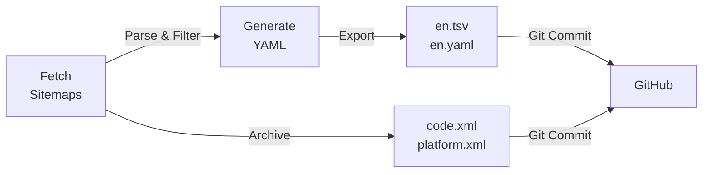

# Claude Docs Sitemap Dataset

Automated daily collection of Claude documentation sitemaps in English, with source archival for traceability.

## 📊 Data Overview

- **Last Updated**: Auto-updated daily at **02:00 UTC** via GitHub Actions
- **Sources**: 
  - `code.claude.com` (code/API documentation)
  - `platform.claude.com` (platform documentation)
- **Language Filter**: English (EN) URLs only
- **Total URLs**: ~762 (varies based on upstream updates)

## 📁 Available Formats

### 1. **`en.tsv`** (Recommended for GitHub/Excel)
Tab-separated table format, perfect for:
- Direct preview on GitHub (rendered as table)
- Import into Excel / Google Sheets
- Copy-paste workflows
- Simple text diff in PRs

| Column | Description |
|--------|-------------|
| `source` | Data source: `code` or `platform` |
| `loc` | Full URL |
| `lastmod` | Last modified timestamp (ISO 8601); empty if not provided |
| `priority` | SEO priority (0.0–1.0); empty if not provided |

**Preview**: 762 rows × 4 columns

### 2. **`en.yaml`** (Source of Truth)
Complete YAML format preserving all sitemap fields:
- Includes any additional fields from upstream XML (e.g., `changefreq`)
- Canonical source for all downstream formats
- Suitable for programmatic processing

**Preview**: ~84 KB, YAML with `explicit_start: true`

### 3. **Source XML Archives**
Preserved for traceability and historical comparison:
- `code.xml`: Full sitemap from code.claude.com (all languages, ~70 KB)
- `platform.xml`: Full sitemap from platform.claude.com (all languages, ~302 KB)

## 🔄 Update Process



- **Trigger**: Every day at **02:00 UTC** (cron: `0 2 * * *`)
- **Manual Trigger**: Use `workflow_dispatch` or:
  ```bash
  gh workflow run update-sitemaps.yml
  ```
- **Auto-Commit**: Only commits if data changes (diff detected)
- **Retry Logic**: 3 attempts with exponential backoff for transient network errors

## 🧹 Language Filtering Rules

### `code.claude.com`
- **Rule**: URLs must contain `/docs/en/` path segment
- **Example**: ✓ `https://code.claude.com/docs/en/amazon-bedrock`

### `platform.claude.com`
- **Rule**: Exclude URLs with non-English language codes in path
  - Excludes: `/zh`, `/zh-TW`, `/de`, `/ja`, `/ko`, `/fr`, `/es`, `/pt`, `/pt-BR`, `/it`, `/ru` etc.
- **Example**: ✓ `https://platform.claude.com/docs/en/about-claude`
- **Example**: ✗ `https://platform.claude.com/docs/zh-TW/about-claude`

## 📥 Usage Examples

### Download & Use in Python (Pandas)
```python
import pandas as pd

# TSV
df = pd.read_csv('data/sitemaps/en.tsv', sep='\t')
df_code = df[df['source'] == 'code']
df_platform = df[df['source'] == 'platform']

# Filter by lastmod date
df_updated = df[df['lastmod'].str.startswith('2025-12')]
```

### Download & Use in Excel
1. Download `en.tsv` from GitHub
2. Open directly in Excel (or copy-paste)
3. Use as table data

### Programmatic Use (YAML)
```python
import yaml

with open('data/sitemaps/en.yaml') as f:
    data = yaml.safe_load(f)
    
for url_entry in data:
    print(f"{url_entry['source']}: {url_entry['loc']}")
```

## 📊 Sample Data

| source | loc | lastmod | priority |
|--------|-----|---------|----------|
| code | https://code.claude.com/docs/en/amazon-bedrock | 2025-12-16T19:42:30.817Z | |
| code | https://code.claude.com/docs/en/analytics | 2025-11-06T11:15:15.210Z | |
| platform | https://platform.claude.com/docs | | 0.8 |
| platform | https://platform.claude.com/docs/en/about-claude/glossary | | 0.8 |

## 🔍 Historical Tracking

Each commit includes:
- Generated YAML/TSV with current snapshot
- Archived source XMLs from that date
- Commit message: `chore(sitemap): update EN sitemap dataset (YYYY-MM-DD)`

This allows you to:
- Compare sitemap changes over time via `git log` + diff
- Trace data lineage back to the original XML sources
- Audit when URLs were added/removed/modified

## 🛠️ Technical Details

- **Language**: Python 3.11+
- **Dependencies**: `pyyaml` (auto-installed in CI)
- **No external APIs**: Pure stdlib (`urllib`, `xml.etree`)
- **Network Resilience**: 3 retries with exponential backoff on SSL/timeout errors
- **Stable Output**: Deterministic sorting ensures clean diffs

## 📋 File Structure

```
data/sitemaps/
├── en.tsv                # Main table format (GitHub-friendly)
├── en.yaml               # Source format (all fields preserved)
├── code.xml              # Full code.claude.com sitemap (source archive)
└── platform.xml          # Full platform.claude.com sitemap (source archive)

scripts/
├── fetch_sitemaps.py     # Core script (auto-retry, multi-format output)
├── update_sitemaps.sh    # Entrypoint for CI/local execution
└── __pycache__/          # (ignored, see .gitignore)

.github/workflows/
└── update-sitemaps.yml   # GitHub Actions workflow definition
```

## 🐛 Troubleshooting

### TSV not updating?
1. Check GitHub Actions logs: `.github/workflows/update-sitemaps.yml` runs
2. Verify script: `python3 scripts/fetch_sitemaps.py`
3. Common issues:
   - SSL timeout on source sitemaps → script retries automatically
   - Network issues in CI → check GitHub Actions runner logs

### Want to run manually?
```bash
# Install deps
pip install pyyaml

# Generate
bash scripts/update_sitemaps.sh

# Check output
head -5 data/sitemaps/en.tsv
```

## 📜 License

Data sourced from public Claude documentation sitemaps. Archive formats and generation tooling are provided as-is for informational and analytical purposes.

---

**Questions or feedback?** Open an issue or check the upstream sources:
- Code Docs: https://code.claude.com/docs
- Platform Docs: https://platform.claude.com/docs
