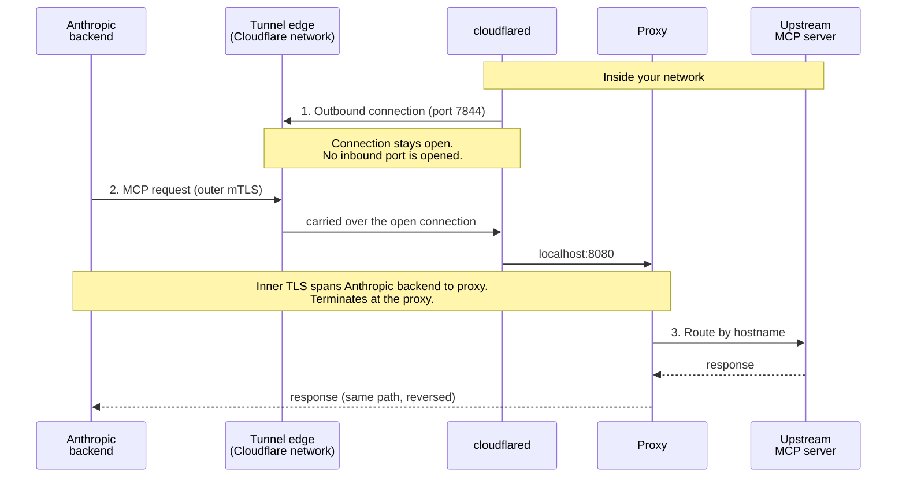

# Arsitektur dan komponen

Nama kanonis untuk bagian-bagian dari deployment MCP tunnel, dua mode penyediaan kredensial, dan model koneksi.

---

<Note>
  Tunnel MCP sedang dalam pratinjau riset. [Minta akses](https://claude.com/form/claude-managed-agents) untuk mencobanya.
</Note>

Halaman ini mendefinisikan istilah-istilah yang digunakan di seluruh dokumentasi [MCP tunnels](/docs/id/agents-and-tools/mcp-tunnels/overview). Beberapa komponen muncul dengan nama yang berbeda dalam file konfigurasi, image container, dan teks naratif; tabel berikut memberikan satu nama kanonis untuk masing-masing komponen dan mencantumkan alias yang mungkin Anda temui.

## Komponen \{#components}

| Istilah | Definisi | Juga muncul sebagai |
|---|---|---|
| **Tunnel stack** | Dua container yang Anda jalankan di dalam jaringan Anda untuk terhubung ke sebuah tunnel: proxy dan cloudflared. Satu stack melayani satu tunnel dan dapat direplikasi di beberapa host untuk ketersediaan. Dengan akses terprogram, komponen setup berjalan berdampingan dengan stack untuk menyediakan kredensial. | the stack, the MCP tunnel stack, the tunnel deployment, your deployment |
| **Proxy** | Komponen routing milik Anthropic. Mengakhiri inner TLS, memvalidasi bahwa IP upstream berada dalam rentang yang diizinkan, dan merutekan setiap permintaan ke server MCP upstream berdasarkan hostname. | `mcp-proxy` (nama image, nama service Compose, dan nama container Helm), `mcp-gateway` (path konfigurasi internal container `/etc/mcp-gateway/config.yaml` dan prefiks nilai Helm `gateway.config.*`) |
| **cloudflared** | Konektor tunnel open-source milik Cloudflare. Menginisiasi koneksi outbound-only dari jaringan Anda ke tunnel edge dan membawa lalu lintas terenkripsi antara edge dan proxy. Tidak terkait dengan Managed Agent. | the outbound connector, the tunnel connector |
| **Komponen setup** | Binary `setup`, yang disertakan di dalam image `mcp-proxy`. Dengan akses terprogram, komponen ini melakukan autentikasi melalui Workload Identity Federation, mengambil tunnel token, menghasilkan CA dan sertifikat server, serta mendaftarkan CA tersebut ke Anthropic. Juga menyediakan `renew-cert`. | setup Job (hook pre-install Helm), service `setup` (profil Compose), setup hook, setup binary, setup CLI |
| **Tunnel edge** | Server edge Cloudflare yang dihubungi oleh cloudflared melalui koneksi keluar (rentang IP `198.41.192.0/19` dan `2606:4700:a0::/44`, port 7844 TCP dan UDP). Tunnel yang berjalan di atasnya disediakan dan dikendalikan oleh Anthropic; Cloudflare mengoperasikan jaringan yang mendasarinya. | the edge, the Anthropic-operated tunnel edge |
| **Inner TLS** | Handshake TLS kedua yang dibawa di dalam stream WebSocket plaintext milik tunnel, antara backend Anthropic dan proxy Anda. Proxy menyajikan sertifikat server yang ditandatangani oleh CA yang Anda daftarkan pada tunnel. Karena hanya Anda yang memegang private key, penyedia transport tidak dapat membaca payload permintaan atau respons. | the inner TLS handshake |
| **Server MCP upstream** | Server MCP yang berjalan di jaringan privat Anda yang menjadi tujuan routing proxy. Setiap upstream diekspos sebagai satu subdomain di bawah domain tunnel Anda. | upstream, routed MCP server, tunneled MCP server |

## Penyediaan kredensial \{#credential-provisioning}

Tunnel stack membutuhkan dua kredensial saat runtime: **tunnel token**, yang mengautentikasi koneksi outbound cloudflared, dan **sertifikat server** yang ditandatangani oleh CA yang terdaftar pada tunnel, yang disajikan oleh proxy selama handshake inner TLS. Ada dua cara untuk menyediakannya, yang disajikan di seluruh panduan ini sebagai sepasang tab.

| Mode | Bagaimana kredensial mencapai stack | Nama chart Helm | Label tab |
|---|---|---|---|
| **Akses terprogram** | Komponen setup melakukan autentikasi ke Tunnels API melalui [Workload Identity Federation](/docs/id/manage-claude/workload-identity-federation), mengambil tunnel token, menghasilkan CA dan sertifikat server secara lokal, dan mendaftarkan CA tersebut. Tidak ada secret berumur panjang yang disalin secara manual. Memerlukan aturan federasi dengan scope `org:manage_tunnels`. | Managed mode (`setup.enabled: true`, default) | **With programmatic access** |
| **Manual** | Anda menyalin tunnel token dari Claude Console, menghasilkan CA dan sertifikat server sendiri (misalnya dengan `openssl`), mendaftarkan CA di Console, dan menyediakan token serta sertifikat ke stack sebagai secret. Tidak ada komponen setup yang berjalan. | External mode (`setup.enabled: false`) | **Without programmatic access** |

Mode-mode ini juga disebut sebagai **alur terprogram** (the programmatic flow) dan **alur manual** (the manual flow) dalam panduan deploy.

## Model koneksi \{#connection-model}

Ada dua arah yang bekerja dalam sebuah tunnel, dan keduanya menunjuk ke arah yang berlawanan:

- **Arah koneksi:** cloudflared melakukan koneksi **outbound** dari jaringan Anda ke tunnel edge. Firewall Anda hanya melihat egress pada port 7844; tidak ada port inbound yang dibuka.
- **Arah permintaan:** setelah koneksi tersebut terbentuk, permintaan MCP berjalan **dari Anthropic menuju jaringan Anda** melalui koneksi tersebut, melewati cloudflared ke proxy, dan terus ke server MCP upstream.

Frasa "outbound-only" menggambarkan koneksinya, bukan permintaan yang dibawa melaluinya.

Inner TLS membentang antara backend Anthropic dan proxy Anda. cloudflared dan tunnel edge berada di antara keduanya pada jalur jaringan tetapi hanya melihat ciphertext; proxy adalah tempat pertama di dalam jaringan Anda di mana payload permintaan MCP dapat dibaca.

## Lihat juga \{#see-also}

- [MCP tunnels](/docs/id/agents-and-tools/mcp-tunnels/overview) untuk model keamanan dan tabel tanggung jawab bersama.
- [Referensi MCP tunnels](/docs/id/agents-and-tools/mcp-tunnels/reference) untuk field konfigurasi proxy, persyaratan sertifikat, dan komponen setup.