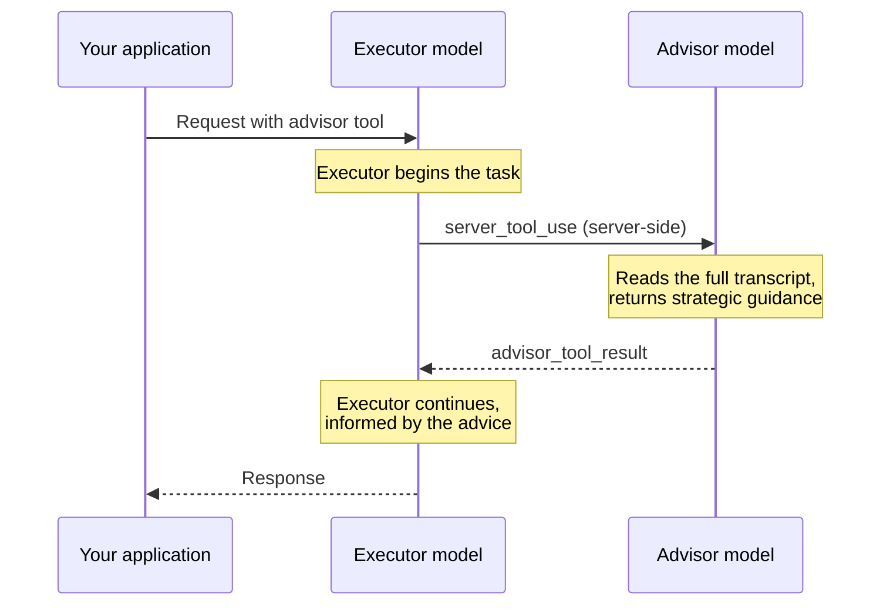

# Alat advisor

Pasangkan model eksekutor yang lebih cepat dengan model advisor berintelegensi lebih tinggi yang memberikan panduan strategis di tengah proses generasi.

---

Alat advisor memungkinkan **model eksekutor** yang lebih cepat dan berbiaya lebih rendah untuk berkonsultasi dengan **model advisor** berintelegensi lebih tinggi di tengah proses generasi untuk mendapatkan panduan strategis. Advisor membaca percakapan lengkap, menghasilkan rencana atau koreksi arah, dan eksekutor melanjutkan tugasnya.

Pola ini cocok untuk beban kerja agentik jangka panjang (agen coding, penggunaan komputer, pipeline riset multi-langkah) di mana sebagian besar giliran bersifat mekanis tetapi memiliki rencana yang sangat baik sangatlah penting. Anda mendapatkan kualitas yang mendekati advisor-saja sementara sebagian besar generasi token terjadi dengan tarif model eksekutor.



<Note>
  Untuk mengetahui bagaimana zero data retention (ZDR) berlaku pada fitur ini, lihat [API dan retensi data](/docs/id/manage-claude/api-and-data-retention).
</Note>

## Kapan menggunakannya

Advisor cocok untuk konfigurasi berikut:

* **Anda saat ini menggunakan Sonnet untuk tugas kompleks:** Tambahkan advisor dengan tingkat yang lebih tinggi. Opus menjaga total biaya tetap serupa atau lebih rendah; Claude Fable 5 memaksimalkan peningkatan kualitas.
* **Anda saat ini menggunakan Haiku dan ingin peningkatan intelegensi:** Tambahkan advisor Opus atau Fable. Perkirakan biaya lebih tinggi daripada Haiku saja, tetapi lebih rendah daripada mengganti eksekutor ke model yang lebih besar.

Hasil bergantung pada tugas. Evaluasi pada beban kerja Anda sendiri.

Advisor kurang cocok untuk Q\&A satu giliran (tidak ada yang perlu direncanakan), pemilih model pass-through murni di mana pengguna Anda sudah memilih sendiri trade-off biaya dan kualitas mereka, atau beban kerja di mana setiap giliran benar-benar memerlukan kemampuan penuh dari model advisor.

## Mulai cepat

<Note>
  Alat advisor sedang dalam tahap beta. Sertakan header beta `advisor-tool-2026-03-01` dalam permintaan Anda.
</Note>

<CodeGroup>
  ```bash cURL
  curl https://api.anthropic.com/v1/messages \
    -H "x-api-key: $ANTHROPIC_API_KEY" \
    -H "anthropic-version: 2023-06-01" \
    -H "anthropic-beta: advisor-tool-2026-03-01" \
    -H "content-type: application/json" \
    -d '{
      "model": "claude-sonnet-5",
      "max_tokens": 4096,
      "tools": [
        {
          "type": "advisor_20260301",
          "name": "advisor",
          "model": "claude-fable-5"
        }
      ],
      "messages": [{
        "role": "user",
        "content": "Build a concurrent worker pool in Go with graceful shutdown."
      }]
    }'
  ```

  ```bash CLI
  ant beta:messages create --beta advisor-tool-2026-03-01 <<'YAML'
  model: claude-sonnet-5
  max_tokens: 4096
  tools:
    - type: advisor_20260301
      name: advisor
      model: claude-fable-5
  messages:
    - role: user
      content: Build a concurrent worker pool in Go with graceful shutdown.
  YAML
  ```

  ```python Python
  client = anthropic.Anthropic()

  response = client.beta.messages.create(
      model="claude-sonnet-5",
      max_tokens=4096,
      betas=["advisor-tool-2026-03-01"],
      tools=[
          {
              "type": "advisor_20260301",
              "name": "advisor",
              "model": "claude-fable-5",
          }
      ],
      messages=[
          {
              "role": "user",
              "content": "Build a concurrent worker pool in Go with graceful shutdown.",
          }
      ],
  )

  print(response)
  ```

  ```typescript TypeScript
  const client = new Anthropic();

  const response = await client.beta.messages.create({
    model: "claude-sonnet-5",
    max_tokens: 4096,
    betas: ["advisor-tool-2026-03-01"],
    tools: [
      {
        type: "advisor_20260301",
        name: "advisor",
        model: "claude-fable-5"
      }
    ],
    messages: [
      {
        role: "user",
        content: "Build a concurrent worker pool in Go with graceful shutdown."
      }
    ]
  });

  console.log(response);
  ```

  ```csharp C#
  using Anthropic.Models.Beta.Messages;
  using Messages = Anthropic.Models.Messages;

  var client = new AnthropicClient();

  var parameters = new MessageCreateParams
  {
      Model = Messages::Model.ClaudeSonnet5,
      MaxTokens = 4096,
      Tools = new BetaToolUnion[]
      {
          new BetaAdvisorTool20260301
          {
              Model = Messages::Model.ClaudeFable5
          }
      },
      Messages =
      [
          new BetaMessageParam
          {
              Role = Role.User,
              Content = "Build a concurrent worker pool in Go with graceful shutdown."
          }
      ],
      Betas = ["advisor-tool-2026-03-01"]
  };

  var response = await client.Beta.Messages.Create(parameters);
  Console.WriteLine(response);
  ```

  ```go Go
  client := anthropic.NewClient()

  response, err := client.Beta.Messages.New(context.TODO(), anthropic.BetaMessageNewParams{
  	Model:     anthropic.ModelClaudeSonnet5,
  	MaxTokens: 4096,
  	Tools: []anthropic.BetaToolUnionParam{
  		{OfAdvisorTool20260301: &anthropic.BetaAdvisorTool20260301Param{
  			Model: anthropic.ModelClaudeFable5,
  		}},
  	},
  	Messages: []anthropic.BetaMessageParam{
  		anthropic.NewBetaUserMessage(anthropic.NewBetaTextBlock("Build a concurrent worker pool in Go with graceful shutdown.")),
  	},
  	Betas: []anthropic.AnthropicBeta{
  		anthropic.AnthropicBetaAdvisorTool2026_03_01,
  	},
  })
  if err != nil {
  	log.Fatal(err)
  }
  fmt.Println(response)
  ```

  ```java Java
  import com.anthropic.models.beta.messages.BetaAdvisorTool20260301;
  import com.anthropic.models.beta.messages.BetaMessage;
  import com.anthropic.models.beta.messages.MessageCreateParams;
  import com.anthropic.models.messages.Model;

  void main() {
      AnthropicClient client = AnthropicOkHttpClient.fromEnv();

      MessageCreateParams params = MessageCreateParams.builder()
          .model(Model.CLAUDE_SONNET_5)
          .maxTokens(4096L)
          .addTool(BetaAdvisorTool20260301.builder()
              .model(Model.CLAUDE_FABLE_5)
              .build())
          .addUserMessage("Build a concurrent worker pool in Go with graceful shutdown.")
          .addBeta("advisor-tool-2026-03-01")
          .build();

      BetaMessage response = client.beta().messages().create(params);
      IO.println(response);
  }
  ```

  ```php PHP
  $client = new Client();

  $response = $client->beta->messages->create(
      maxTokens: 4096,
      messages: [
          [
              'role' => 'user',
              'content' => 'Build a concurrent worker pool in Go with graceful shutdown.',
          ],
      ],
      model: 'claude-sonnet-5',
      tools: [
          [
              'type' => 'advisor_20260301',
              'name' => 'advisor',
              'model' => 'claude-fable-5',
          ],
      ],
      betas: ['advisor-tool-2026-03-01'],
  );

  echo $response;
  ```

  ```ruby Ruby
  client = Anthropic::Client.new

  response = client.beta.messages.create(
    model: "claude-sonnet-5",
    max_tokens: 4096,
    tools: [
      {
        type: "advisor_20260301",
        name: "advisor",
        model: "claude-fable-5"
      }
    ],
    messages: [
      {
        role: "user",
        content: "Build a concurrent worker pool in Go with graceful shutdown."
      }
    ],
    betas: ["advisor-tool-2026-03-01"]
  )

  puts response
  ```
</CodeGroup>

`content` respons menyertakan blok `advisor_tool_result` yang membawa panduan dari advisor. Dengan Claude Fable 5 atau Claude Mythos 5 sebagai advisor, field `content` pada blok tersebut adalah varian `advisor_redacted_result` (terenkripsi; eksekutor membacanya di sisi server, tetapi klien Anda tidak). Untuk melihat teks saran secara langsung dalam respons Anda, gunakan `claude-opus-4-8` sebagai model advisor, yang mengembalikan varian `advisor_result` dalam bentuk teks biasa. Lihat [Varian hasil](#result-variants) untuk kedua bentuk tersebut dan [Kompatibilitas model](#model-compatibility) untuk daftar lengkap pasangan yang valid.

## Cara kerjanya

Ketika Anda menambahkan alat advisor ke array `tools` Anda, model eksekutor menentukan kapan memanggilnya, seperti alat lainnya. Ketika eksekutor memanggil advisor:

1. Eksekutor mengeluarkan blok [`server_tool_use`](/docs/id/agents-and-tools/tool-use/server-tools) dengan `name: "advisor"` dan `input` kosong. Eksekutor memberi sinyal waktu, dan server menyediakan konteks.
2. Anthropic menjalankan proses inferensi terpisah pada model advisor di sisi server. Advisor berjalan di bawah prompt sistem yang disediakan Anthropic sendiri dan menerima transkrip lengkap eksekutor sebagai konteks yang dikutip dalam inputnya. Transkrip tersebut mencakup prompt sistem Anda, definisi alat, giliran sebelumnya dan hasil alat, serta teks yang telah dihasilkan eksekutor sejauh ini dalam giliran ini.
3. Respons advisor kembali ke eksekutor sebagai blok `advisor_tool_result`.
4. Eksekutor melanjutkan generasi, dengan informasi dari saran tersebut.

Semua ini terjadi di dalam satu permintaan `/v1/messages`, tanpa round trip tambahan di sisi Anda. Pengecualiannya adalah giliran yang berhenti sementara di tengah panggilan, yang Anda lanjutkan dengan permintaan lanjutan (lihat [Melanjutkan giliran yang dijeda](#resuming-a-paused-turn)).

Advisor itu sendiri berjalan tanpa alat dan tanpa manajemen konteks. Blok pemikirannya dibuang sebelum hasilnya dikembalikan. Hanya teks saran yang mencapai eksekutor.

## Parameter alat

| Parameter    | Tipe           | Default                    | Deskripsi                                                                                                                                                                                                                                                                                                                                                                                                           |
| ------------ | -------------- | -------------------------- | ------------------------------------------------------------------------------------------------------------------------------------------------------------------------------------------------------------------------------------------------------------------------------------------------------------------------------------------------------------------------------------------------------------------- |
| `type`       | string         | *wajib*                    | Harus `"advisor_20260301"`.                                                                                                                                                                                                                                                                                                                                                                                         |
| `name`       | string         | *wajib*                    | Harus `"advisor"`.                                                                                                                                                                                                                                                                                                                                                                                                  |
| `model`      | string         | *wajib*                    | ID model advisor, seperti claude-fable-5. Ditagih dengan tarif model ini untuk sub-inferensi.                                                                                                                                                                                                                                                                                                                       |
| `max_uses`   | integer        | tidak terbatas             | Jumlah maksimum panggilan advisor yang diizinkan dalam satu permintaan. Setelah eksekutor mencapai batas ini, panggilan advisor berikutnya mengembalikan `advisor_tool_result_error` dengan `error_code: "max_uses_exceeded"` dan eksekutor melanjutkan tanpa saran lebih lanjut. Ini adalah batas per-permintaan, bukan batas per-percakapan. Lihat [Kontrol biaya](#cost-control) untuk batas tingkat percakapan. |
| `max_tokens` | integer        | batas output model advisor | Membatasi total output advisor (pemikiran plus teks) per panggilan. Minimum 1024. Lihat [Membatasi output advisor](#capping-advisor-output).                                                                                                                                                                                                                                                                        |
| `caching`    | object \| null | `null` (nonaktif)          | Mengaktifkan [caching prompt](/docs/id/build-with-claude/prompt-caching) untuk transkrip advisor sendiri di seluruh panggilan dalam satu percakapan. Lihat [Caching prompt advisor](#advisor-prompt-caching).                                                                                                                                                                                                       |

Objek `caching` memiliki bentuk `{"type": "ephemeral", "ttl": "5m" | "1h"}`. Berbeda dengan `cache_control` pada blok konten, ini bukan penanda breakpoint. Ini adalah saklar on/off. Server menentukan di mana batas cache ditempatkan.

Alat advisor juga menerima properti generik yang tersedia pada definisi alat apa pun: `cache_control`, `allowed_callers`, `defer_loading`, dan `strict` (dibahas dalam [structured outputs](/docs/id/build-with-claude/structured-outputs)). Lihat [Referensi alat](/docs/id/agents-and-tools/tool-use/tool-reference#tool-definition-properties) untuk semantiknya.

## Struktur respons

### Panggilan advisor yang berhasil

Ketika advisor dipanggil, blok `server_tool_use` diikuti oleh blok `advisor_tool_result` dalam konten asisten. Contoh berikut menunjukkan varian `advisor_result` dalam bentuk teks biasa yang dikembalikan oleh advisor Claude Opus 4.8. [Mulai cepat](#quick-start) menggunakan Claude Fable 5, yang mengembalikan varian `advisor_redacted_result` terenkripsi sebagai gantinya; lihat [Varian hasil](#result-variants).

```json
{
  "role": "assistant",
  "content": [
    {
      "type": "text",
      "text": "Let me consult the advisor on this."
    },
    {
      "type": "server_tool_use",
      "id": "srvtoolu_abc123",
      "name": "advisor",
      "input": {}
    },
    {
      "type": "advisor_tool_result",
      "tool_use_id": "srvtoolu_abc123",
      "content": {
        "type": "advisor_result",
        "text": "Use a channel-based coordination pattern. The tricky part is draining in-flight work during shutdown: close the input channel first, then wait on a WaitGroup..."
      }
    },
    {
      "type": "text",
      "text": "Here's the implementation. I'm using a channel-based coordination pattern to avoid writer starvation..."
    }
  ]
}
```

`server_tool_use.input` selalu kosong. Server membangun tampilan advisor dari transkrip lengkap secara otomatis. Tidak ada yang dimasukkan eksekutor ke dalam `input` yang mencapai advisor.

### Varian hasil

Field `advisor_tool_result.content` adalah discriminated union. Untuk panggilan yang berhasil, variannya bergantung pada model advisor:

| Varian                    | Field                              | Dikembalikan ketika                                                 |
| ------------------------- | ---------------------------------- | ------------------------------------------------------------------- |
| `advisor_result`          | `text`, `stop_reason`              | Model advisor mengembalikan teks biasa (misalnya, Claude Opus 4.8). |
| `advisor_redacted_result` | `encrypted_content`, `stop_reason` | Model advisor mengembalikan output terenkripsi.                     |

Advisor Claude Fable 5 dan Claude Mythos 5 mengembalikan `advisor_redacted_result`. Model advisor lainnya dalam [tabel kompatibilitas](#model-compatibility) mengembalikan `advisor_result`.

Kedua varian hasil membawa field `stop_reason` ketika Anda mengatur [`max_tokens`](#capping-advisor-output) pada definisi alat, dan menghilangkannya ketika Anda tidak mengaturnya. Field ini menyimpan alasan berhenti dari sub-panggilan advisor, biasanya `"end_turn"`, atau `"max_tokens"` ketika batas tercapai. Nilainya sesuai dengan [`stop_reason`](/docs/id/build-with-claude/handling-stop-reasons) tingkat atas pada Messages API.

Dengan `advisor_result`, field `text` berisi saran yang dapat dibaca manusia. Dengan `advisor_redacted_result`, field `encrypted_content` berisi blob buram yang tidak dapat Anda baca. Pada giliran berikutnya, server mendekripsinya dan merender teks biasa ke dalam prompt eksekutor.

Dalam kedua kasus, kirimkan kembali konten tersebut secara verbatim pada giliran berikutnya. Jika Anda mengganti model advisor di tengah percakapan, lakukan percabangan pada `content.type` untuk menangani kedua bentuk.

### Hasil error

Jika panggilan advisor gagal, hasilnya membawa error:

```json
{
  "type": "advisor_tool_result",
  "tool_use_id": "srvtoolu_abc123",
  "content": {
    "type": "advisor_tool_result_error",
    "error_code": "overloaded"
  }
}
```

Eksekutor melihat error tersebut dan melanjutkan tanpa saran lebih lanjut. Permintaan itu sendiri tidak gagal.

| `error_code`              | Arti                                                                                                                                                  |
| ------------------------- | ----------------------------------------------------------------------------------------------------------------------------------------------------- |
| `max_uses_exceeded`       | Permintaan mencapai batas `max_uses` yang diatur pada definisi alat. Panggilan advisor berikutnya dalam permintaan yang sama mengembalikan error ini. |
| `too_many_requests`       | Sub-inferensi advisor terkena batas laju.                                                                                                             |
| `overloaded`              | Sub-inferensi advisor mencapai batas kapasitas.                                                                                                       |
| `prompt_too_long`         | Transkrip melebihi jendela konteks model advisor.                                                                                                     |
| `execution_time_exceeded` | Sub-inferensi advisor kehabisan waktu.                                                                                                                |
| `unavailable`             | Kegagalan advisor lainnya.                                                                                                                            |

Batas laju advisor diambil dari bucket per-model yang sama dengan panggilan langsung ke model advisor. Batas laju pada advisor muncul sebagai `too_many_requests` di dalam hasil alat. Batas laju pada eksekutor menggagalkan seluruh permintaan dengan HTTP 429.

## Percakapan multi-giliran

Kirimkan kembali konten asisten lengkap, termasuk blok `advisor_tool_result`, ke API pada giliran berikutnya. Contoh ini menggunakan `claude-opus-4-8` sebagai advisor sehingga saran dalam bentuk teks biasa terlihat di `response.content`; mekanismenya identik untuk model advisor apa pun.

<CodeGroup exclude="shell, go">
  ```python Python
  client = anthropic.Anthropic()

  tools = [
      {
          "type": "advisor_20260301",
          "name": "advisor",
          "model": "claude-opus-4-8",
      }
  ]

  messages = [
      {
          "role": "user",
          "content": "Build a concurrent worker pool in Go with graceful shutdown.",
      }
  ]

  response = client.beta.messages.create(
      model="claude-sonnet-5",
      max_tokens=1024,
      betas=["advisor-tool-2026-03-01"],
      tools=tools,
      messages=messages,
  )

  # Tambahkan seluruh konten respons, termasuk blok advisor_tool_result apa pun
  messages.append({"role": "assistant", "content": response.content})

  # Lanjutkan percakapan
  messages.append({"role": "user", "content": "Now add a max-in-flight limit of 10."})

  response = client.beta.messages.create(
      model="claude-sonnet-5",
      max_tokens=1024,
      betas=["advisor-tool-2026-03-01"],
      tools=tools,
      messages=messages,
  )
  ```

  ```typescript TypeScript
  const client = new Anthropic();

  const tools: Anthropic.Beta.Messages.BetaToolUnion[] = [
    {
      type: "advisor_20260301",
      name: "advisor",
      model: "claude-opus-4-8"
    }
  ];

  const messages: Anthropic.Beta.Messages.BetaMessageParam[] = [
    {
      role: "user",
      content: "Build a concurrent worker pool in Go with graceful shutdown."
    }
  ];

  const response = await client.beta.messages.create({
    model: "claude-sonnet-5",
    max_tokens: 1024,
    betas: ["advisor-tool-2026-03-01"],
    tools,
    messages
  });

  // Tambahkan seluruh konten respons, termasuk blok advisor_tool_result apa pun
  messages.push({ role: "assistant", content: response.content });

  // Lanjutkan percakapan
  messages.push({ role: "user", content: "Now add a max-in-flight limit of 10." });

  const followUp = await client.beta.messages.create({
    model: "claude-sonnet-5",
    max_tokens: 1024,
    betas: ["advisor-tool-2026-03-01"],
    tools,
    messages
  });
  ```

  ```csharp C#
  using Anthropic.Models.Beta.Messages;
  using Messages = Anthropic.Models.Messages;

  var client = new AnthropicClient();

  var tools = new BetaToolUnion[]
  {
      new BetaAdvisorTool20260301 { Model = Messages::Model.ClaudeOpus4_8 }
  };

  var messages = new List<BetaMessageParam>
  {
      new() { Role = Role.User, Content = "Build a concurrent worker pool in Go with graceful shutdown." }
  };

  var response = await client.Beta.Messages.Create(new MessageCreateParams
  {
      Model = Messages::Model.ClaudeSonnet5,
      MaxTokens = 1024,
      Tools = tools,
      Messages = messages,
      Betas = ["advisor-tool-2026-03-01"]
  });

  // Tambahkan seluruh konten respons, termasuk blok advisor_tool_result apa pun
  messages.Add(new BetaMessageParam
  {
      Role = Role.Assistant,
      Content = response.Content.Select(block => new BetaContentBlockParam(block.Json)).ToList()
  });

  // Lanjutkan percakapan
  messages.Add(new BetaMessageParam { Role = Role.User, Content = "Now add a max-in-flight limit of 10." });

  var followUp = await client.Beta.Messages.Create(new MessageCreateParams
  {
      Model = Messages::Model.ClaudeSonnet5,
      MaxTokens = 1024,
      Tools = tools,
      Messages = messages,
      Betas = ["advisor-tool-2026-03-01"]
  });
  ```

  ```java Java
  import com.anthropic.models.beta.messages.BetaAdvisorTool20260301;
  import com.anthropic.models.beta.messages.BetaContentBlock;
  import com.anthropic.models.beta.messages.BetaMessage;
  import com.anthropic.models.beta.messages.BetaMessageParam;
  import com.anthropic.models.beta.messages.BetaToolUnion;
  import com.anthropic.models.beta.messages.MessageCreateParams;
  import com.anthropic.models.messages.Model;

  void main() {
      AnthropicClient client = AnthropicOkHttpClient.fromEnv();

      List<BetaToolUnion> tools = List.of(
          BetaToolUnion.ofAdvisorTool20260301(
              BetaAdvisorTool20260301.builder().model(Model.CLAUDE_OPUS_4_8).build()));

      List<BetaMessageParam> messages = new ArrayList<>();
      messages.add(BetaMessageParam.builder()
          .role(BetaMessageParam.Role.USER)
          .content("Build a concurrent worker pool in Go with graceful shutdown.")
          .build());

      BetaMessage response = client.beta().messages().create(MessageCreateParams.builder()
          .model(Model.CLAUDE_SONNET_5)
          .maxTokens(4096L)
          .tools(tools)
          .messages(messages)
          .addBeta("advisor-tool-2026-03-01")
          .build());

      // Tambahkan seluruh konten respons, termasuk blok advisor_tool_result apa pun
      messages.add(BetaMessageParam.builder()
          .role(BetaMessageParam.Role.ASSISTANT)
          .contentOfBetaContentBlockParams(
              response.content().stream().map(BetaContentBlock::toParam).toList())
          .build());

      // Lanjutkan percakapan
      messages.add(BetaMessageParam.builder()
          .role(BetaMessageParam.Role.USER)
          .content("Now add a max-in-flight limit of 10.")
          .build());

      BetaMessage followUp = client.beta().messages().create(MessageCreateParams.builder()
          .model(Model.CLAUDE_SONNET_5)
          .maxTokens(4096L)
          .tools(tools)
          .messages(messages)
          .addBeta("advisor-tool-2026-03-01")
          .build());
  }
  ```

  ```php PHP
  $client = new Client();

  $tools = [
      [
          'type' => 'advisor_20260301',
          'name' => 'advisor',
          'model' => 'claude-opus-4-8',
      ],
  ];

  $messages = [
      [
          'role' => 'user',
          'content' => 'Build a concurrent worker pool in Go with graceful shutdown.',
      ],
  ];

  $response = $client->beta->messages->create(
      maxTokens: 1024,
      messages: $messages,
      model: 'claude-sonnet-5',
      tools: $tools,
      betas: ['advisor-tool-2026-03-01'],
  );

  // Tambahkan seluruh konten respons, termasuk blok advisor_tool_result apa pun
  $messages[] = ['role' => 'assistant', 'content' => $response->content];

  // Lanjutkan percakapan
  $messages[] = ['role' => 'user', 'content' => 'Now add a max-in-flight limit of 10.'];

  $response = $client->beta->messages->create(
      maxTokens: 1024,
      messages: $messages,
      model: 'claude-sonnet-5',
      tools: $tools,
      betas: ['advisor-tool-2026-03-01'],
  );
  ```

  ```ruby Ruby
  client = Anthropic::Client.new

  tools = [
    {
      type: "advisor_20260301",
      name: "advisor",
      model: "claude-opus-4-8"
    }
  ]

  messages = [
    {
      role: "user",
      content: "Build a concurrent worker pool in Go with graceful shutdown."
    }
  ]

  response = client.beta.messages.create(
    model: "claude-sonnet-5",
    max_tokens: 1024,
    tools: tools,
    messages: messages,
    betas: ["advisor-tool-2026-03-01"]
  )

  # Tambahkan seluruh konten respons, termasuk blok advisor_tool_result apa pun
  messages << { role: "assistant", content: response.content }

  # Lanjutkan percakapan
  messages << { role: "user", content: "Now add a max-in-flight limit of 10." }

  response = client.beta.messages.create(
    model: "claude-sonnet-5",
    max_tokens: 1024,
    tools: tools,
    messages: messages,
    betas: ["advisor-tool-2026-03-01"]
  )
  ```
</CodeGroup>

Jika Anda menghilangkan alat advisor dari `tools` pada giliran lanjutan sementara riwayat pesan masih berisi blok `advisor_tool_result`, API mengembalikan `400 invalid_request_error`.

<Note>
  Alat advisor tidak memiliki batas tingkat percakapan bawaan. Untuk membatasi panggilan advisor di seluruh percakapan, hitung di sisi klien. Ketika Anda mencapai batas Anda, hapus alat advisor dari array `tools` Anda **dan** hapus semua blok `advisor_tool_result` dari riwayat pesan Anda untuk menghindari `400 invalid_request_error`.
</Note>

### Melanjutkan giliran yang dijeda

Respons dapat berakhir dengan `stop_reason: "pause_turn"` sementara panggilan advisor masih tertunda. Ketika itu terjadi, respons berisi blok `server_tool_use` advisor tanpa `advisor_tool_result` untuknya. Untuk melanjutkan, tambahkan pesan asisten tersebut ke `messages` dengan kontennya tidak berubah, dengan tetap mempertahankan blok `server_tool_use`, dan kirim permintaan lagi dengan alat advisor dan header beta yang sama. Anda tidak perlu menambahkan pesan pengguna atau blok `tool_result`. API menjalankan panggilan advisor yang tertunda dan melanjutkan giliran eksekutor dalam respons baru. Giliran yang dilanjutkan dapat dijeda lagi. Jika itu terjadi, ulangi langkah yang sama. Menghilangkan alat advisor dari permintaan lanjutan mengembalikan `400 invalid_request_error`. Jika sebaliknya eksekutor memanggil salah satu alat Anda dalam giliran yang sama, respons berakhir dengan `stop_reason: "tool_use"` sementara panggilan advisor masih tertunda. Kirim blok `tool_result` seperti biasa, dan panggilan advisor yang tertunda berjalan di awal permintaan berikutnya. Lihat [Menggabungkan alat server dan alat klien dalam satu giliran](/docs/id/agents-and-tools/tool-use/server-tools#mixing-server-tools-and-client-tools-in-one-turn).

### Dorongan di tengah percakapan untuk eksekutor yang kurang memanggil

Jika eksekutor Haiku belum memanggil advisor pada giliran asisten pertamanya, tambahkan pengingat singkat sebagai pesan pengguna tambahan sebelum giliran asisten kedua. Dalam evaluasi perilaku internal Anthropic, ini meningkatkan tingkat kelulusan tugas sekitar 7 poin persentase pada eksekutor Haiku. Pada eksekutor Sonnet, dorongan teks biasa tidak memiliki efek yang terukur dalam pengujian Anthropic. Pertimbangan waktu panggilan yang mengikuti sangat relevan untuk Sonnet. Jangan terapkan dorongan pada eksekutor Opus: Pada Opus, ini sedikit menurunkan tingkat kelulusan.

Dengan `NUDGE_TURN` default sebesar 2, pengingat biasanya tiba setelah model berorientasi pada tugas tetapi sebelum berkomitmen pada suatu pendekatan.

<CodeGroup exclude="shell, go">
  ```python Python
  client = anthropic.Anthropic()

  NUDGE_TURN = 2  # inject before this assistant turn if no advisor call yet
  NUDGE_TEXT = (
      "You have not consulted the advisor yet. If the task has a non-obvious "
      "design decision or a failure mode you haven't ruled out, call advisor "
      "now before committing to an approach."
  )
  MAX_TURNS = 10  # agent loop cap


  def run_your_tools(content):
      # Ganti dengan dispatch alat Anda. Mengembalikan satu blok tool_result per blok tool_use.
      return [
          {
              "type": "tool_result",
              "tool_use_id": block.id,
              "content": "Replace with your tool output.",
          }
          for block in content
          if block.type == "tool_use"
      ]


  tools = [
      {"type": "advisor_20260301", "name": "advisor", "model": "claude-fable-5"},
      # ... alat Anda yang lain
  ]
  task = "Build a concurrent worker pool in Go with graceful shutdown."
  messages = [{"role": "user", "content": task}]
  advisor_called = False

  for turn in range(1, MAX_TURNS + 1):
      response = client.beta.messages.create(
          model="claude-haiku-4-5",
          max_tokens=4096,
          betas=["advisor-tool-2026-03-01"],
          tools=tools,
          messages=messages,
      )
      messages.append({"role": "assistant", "content": response.content})
      advisor_called = advisor_called or any(
          block.type == "server_tool_use" and block.name == "advisor"
          for block in response.content
      )
      if response.stop_reason == "end_turn":
          break
      if response.stop_reason == "pause_turn":
          continue  # server tool pending; re-send to let the API complete it

      results = run_your_tools(response.content)  # list of tool_result blocks
      if results:
          messages.append({"role": "user", "content": results})
      # Lewati ini jika prompt sistem Anda sudah meminta model untuk memanggil seperlunya.
      if turn == NUDGE_TURN - 1 and not advisor_called:
          messages.append({"role": "user", "content": NUDGE_TEXT})
  ```

  ```typescript TypeScript
  const client = new Anthropic();

  const NUDGE_TURN = 2; // inject before this assistant turn if no advisor call yet
  const NUDGE_TEXT =
    "You have not consulted the advisor yet. If the task has a non-obvious " +
    "design decision or a failure mode you haven't ruled out, call advisor " +
    "now before committing to an approach.";
  const MAX_TURNS = 10; // agent loop cap

  function runYourTools(
    content: Anthropic.Beta.Messages.BetaContentBlock[]
  ): Anthropic.Beta.Messages.BetaToolResultBlockParam[] {
    // Ganti dengan dispatch alat Anda. Mengembalikan satu blok tool_result per blok tool_use.
    return content
      .filter((block) => block.type === "tool_use")
      .map((block) => ({
        type: "tool_result" as const,
        tool_use_id: block.id,
        content: "Replace with your tool output."
      }));
  }

  const tools: Anthropic.Beta.Messages.BetaToolUnion[] = [
    { type: "advisor_20260301", name: "advisor", model: "claude-fable-5" }
    // ... alat Anda yang lain
  ];
  const task = "Build a concurrent worker pool in Go with graceful shutdown.";
  const messages: Anthropic.Beta.Messages.BetaMessageParam[] = [{ role: "user", content: task }];
  let advisorCalled = false;

  for (let turn = 1; turn <= MAX_TURNS; turn++) {
    const response = await client.beta.messages.create({
      model: "claude-haiku-4-5",
      max_tokens: 4096,
      betas: ["advisor-tool-2026-03-01"],
      tools,
      messages
    });
    messages.push({ role: "assistant", content: response.content });
    advisorCalled =
      advisorCalled ||
      response.content.some(
        (block) => block.type === "server_tool_use" && block.name === "advisor"
      );
    if (response.stop_reason === "end_turn") {
      break;
    }
    if (response.stop_reason === "pause_turn") {
      continue; // server tool pending; re-send to let the API complete it
    }

    const results = runYourTools(response.content); // list of tool_result blocks
    if (results.length > 0) {
      messages.push({ role: "user", content: results });
    }
    // Lewati ini jika prompt sistem Anda sudah memberi tahu model untuk memanggil seperlunya.
    if (turn === NUDGE_TURN - 1 && !advisorCalled) {
      messages.push({ role: "user", content: NUDGE_TEXT });
    }
  }
  ```

  ```csharp C#
  using Anthropic.Models.Beta.Messages;
  using Messages = Anthropic.Models.Messages;

  var client = new AnthropicClient();

  const int NudgeTurn = 2; // inject before this assistant turn if no advisor call yet
  const string NudgeText =
      "You have not consulted the advisor yet. If the task has a non-obvious "
      + "design decision or a failure mode you haven't ruled out, call advisor "
      + "now before committing to an approach.";
  const int MaxTurns = 10; // agent loop cap

  // Ganti dengan dispatch alat Anda. Mengembalikan satu blok tool_result untuk setiap blok tool_use.
  List<BetaContentBlockParam> RunYourTools(IReadOnlyList<BetaContentBlock> content)
  {
      List<BetaContentBlockParam> results = [];
      foreach (var block in content)
      {
          if (block.TryPickToolUse(out var toolUse))
          {
              results.Add(new BetaToolResultBlockParam
              {
                  ToolUseID = toolUse.ID,
                  Content = "Replace with your tool output."
              });
          }
      }
      return results;
  }

  var tools = new BetaToolUnion[]
  {
      new BetaAdvisorTool20260301 { Model = Messages::Model.ClaudeFable5 }
      // ... alat Anda yang lain
  };
  var task = "Build a concurrent worker pool in Go with graceful shutdown.";
  var messages = new List<BetaMessageParam> { new() { Role = Role.User, Content = task } };
  var advisorCalled = false;

  for (var turn = 1; turn <= MaxTurns; turn++)
  {
      var response = await client.Beta.Messages.Create(new MessageCreateParams
      {
          Model = Messages::Model.ClaudeHaiku4_5,
          MaxTokens = 4096,
          Tools = tools,
          Messages = messages,
          Betas = ["advisor-tool-2026-03-01"]
      });
      messages.Add(new BetaMessageParam
      {
          Role = Role.Assistant,
          Content = response.Content.Select(block => new BetaContentBlockParam(block.Json)).ToList()
      });
      advisorCalled =
          advisorCalled
          || response.Content.Any(block =>
              block.TryPickServerToolUse(out var serverToolUse)
              && serverToolUse.Name.Value() == Name.Advisor
          );
      if (response.StopReason == BetaStopReason.EndTurn)
      {
          break;
      }
      if (response.StopReason == BetaStopReason.PauseTurn)
      {
          continue; // server tool pending; re-send to let the API complete it
      }

      var results = RunYourTools(response.Content); // list of tool_result blocks
      if (results.Count > 0)
      {
          messages.Add(new BetaMessageParam { Role = Role.User, Content = results });
      }
      // Lewati ini jika prompt sistem Anda sudah meminta model untuk memanggil seperlunya.
      if (turn == NudgeTurn - 1 && !advisorCalled)
      {
          messages.Add(new BetaMessageParam { Role = Role.User, Content = NudgeText });
      }
  }
  ```

  ```java Java
  import com.anthropic.models.beta.messages.BetaAdvisorTool20260301;
  import com.anthropic.models.beta.messages.BetaContentBlock;
  import com.anthropic.models.beta.messages.BetaContentBlockParam;
  import com.anthropic.models.beta.messages.BetaMessage;
  import com.anthropic.models.beta.messages.BetaMessageParam;
  import com.anthropic.models.beta.messages.BetaServerToolUseBlock;
  import com.anthropic.models.beta.messages.BetaStopReason;
  import com.anthropic.models.beta.messages.BetaToolResultBlockParam;
  import com.anthropic.models.beta.messages.BetaToolUnion;
  import com.anthropic.models.beta.messages.MessageCreateParams;
  import com.anthropic.models.messages.Model;

  static final int NUDGE_TURN = 2; // inject before this assistant turn if no advisor call yet
  static final String NUDGE_TEXT =
      "You have not consulted the advisor yet. If the task has a non-obvious "
          + "design decision or a failure mode you haven't ruled out, call advisor "
          + "now before committing to an approach.";
  static final int MAX_TURNS = 10; // agent loop cap

  // Ganti dengan dispatch alat Anda. Mengembalikan satu blok tool_result per blok tool_use.
  List<BetaContentBlockParam> runYourTools(List<BetaContentBlock> content) {
      List<BetaContentBlockParam> results = new ArrayList<>();
      for (BetaContentBlock block : content) {
          if (block.isToolUse()) {
              results.add(BetaContentBlockParam.ofToolResult(
                  BetaToolResultBlockParam.builder()
                      .toolUseId(block.asToolUse().id())
                      .content("Replace with your tool output.")
                      .build()));
          }
      }
      return results;
  }

  void main() {
      AnthropicClient client = AnthropicOkHttpClient.fromEnv();

      List<BetaToolUnion> tools = List.of(
          BetaToolUnion.ofAdvisorTool20260301(
              BetaAdvisorTool20260301.builder().model(Model.CLAUDE_FABLE_5).build())
          // ... alat Anda yang lain
      );
      String task = "Build a concurrent worker pool in Go with graceful shutdown.";
      List<BetaMessageParam> messages = new ArrayList<>();
      messages.add(BetaMessageParam.builder()
          .role(BetaMessageParam.Role.USER)
          .content(task)
          .build());
      boolean advisorCalled = false;

      for (int turn = 1; turn <= MAX_TURNS; turn++) {
          BetaMessage response = client.beta().messages().create(MessageCreateParams.builder()
              .model(Model.CLAUDE_HAIKU_4_5)
              .maxTokens(4096L)
              .tools(tools)
              .messages(messages)
              .addBeta("advisor-tool-2026-03-01")
              .build());
          messages.add(BetaMessageParam.builder()
              .role(BetaMessageParam.Role.ASSISTANT)
              .contentOfBetaContentBlockParams(
                  response.content().stream().map(BetaContentBlock::toParam).toList())
              .build());
          advisorCalled = advisorCalled
              || response.content().stream().anyMatch(block ->
                  block.isServerToolUse()
                      && block.asServerToolUse().name().equals(BetaServerToolUseBlock.Name.ADVISOR));
          BetaStopReason stopReason = response.stopReason().orElse(null);
          if (BetaStopReason.END_TURN.equals(stopReason)) {
              break;
          }
          if (BetaStopReason.PAUSE_TURN.equals(stopReason)) {
              continue; // server tool pending; re-send to let the API complete it
          }

          List<BetaContentBlockParam> results = runYourTools(response.content()); // list of tool_result blocks
          if (!results.isEmpty()) {
              messages.add(BetaMessageParam.builder()
                  .role(BetaMessageParam.Role.USER)
                  .contentOfBetaContentBlockParams(results)
                  .build());
          }
          // Lewati ini jika prompt sistem Anda sudah memberi tahu model untuk memanggil seperlunya.
          if (turn == NUDGE_TURN - 1 && !advisorCalled) {
              messages.add(BetaMessageParam.builder()
                  .role(BetaMessageParam.Role.USER)
                  .content(NUDGE_TEXT)
                  .build());
          }
      }
  }
  ```

  ```php PHP
  $client = new Client();

  const NUDGE_TURN = 2; // inject before this assistant turn if no advisor call yet
  const NUDGE_TEXT = "You have not consulted the advisor yet. If the task has a non-obvious "
      . "design decision or a failure mode you haven't ruled out, call advisor "
      . "now before committing to an approach.";
  const MAX_TURNS = 10; // agent loop cap

  // Ganti dengan dispatch alat Anda. Mengembalikan satu blok tool_result per blok tool_use.
  function runYourTools(array $content): array
  {
      $results = [];
      foreach ($content as $block) {
          if ($block->type === 'tool_use') {
              $results[] = [
                  'type' => 'tool_result',
                  'tool_use_id' => $block->id,
                  'content' => 'Replace with your tool output.',
              ];
          }
      }
      return $results;
  }

  $tools = [
      ['type' => 'advisor_20260301', 'name' => 'advisor', 'model' => 'claude-fable-5'],
      // ... alat Anda yang lain
  ];
  $task = 'Build a concurrent worker pool in Go with graceful shutdown.';
  $messages = [['role' => 'user', 'content' => $task]];
  $advisorCalled = false;

  for ($turn = 1; $turn <= MAX_TURNS; $turn++) {
      $response = $client->beta->messages->create(
          maxTokens: 4096,
          messages: $messages,
          model: 'claude-haiku-4-5',
          tools: $tools,
          betas: ['advisor-tool-2026-03-01'],
      );
      $messages[] = ['role' => 'assistant', 'content' => $response->content];
      foreach ($response->content as $block) {
          if ($block->type === 'server_tool_use' && $block->name === 'advisor') {
              $advisorCalled = true;
          }
      }
      if ($response->stopReason === 'end_turn') {
          break;
      }
      if ($response->stopReason === 'pause_turn') {
          continue; // server tool pending; re-send to let the API complete it
      }

      $results = runYourTools($response->content); // list of tool_result blocks
      if ($results !== []) {
          $messages[] = ['role' => 'user', 'content' => $results];
      }
      // Lewati ini jika prompt sistem Anda sudah memberi tahu model untuk memanggil seperlunya.
      if ($turn === NUDGE_TURN - 1 && !$advisorCalled) {
          $messages[] = ['role' => 'user', 'content' => NUDGE_TEXT];
      }
  }
  ```

  ```ruby Ruby
  client = Anthropic::Client.new

  NUDGE_TURN = 2 # inject before this assistant turn if no advisor call yet
  NUDGE_TEXT =
    "You have not consulted the advisor yet. If the task has a non-obvious " \
    "design decision or a failure mode you haven't ruled out, call advisor " \
    "now before committing to an approach."
  MAX_TURNS = 10 # agent loop cap

  # Ganti dengan dispatch alat Anda. Mengembalikan satu blok tool_result per blok tool_use.
  def run_your_tools(content)
    content.filter_map do |block|
      next unless block.type == :tool_use
      { type: "tool_result", tool_use_id: block.id, content: "Replace with your tool output." }
    end
  end

  tools = [
    { type: "advisor_20260301", name: "advisor", model: "claude-fable-5" }
    # ... alat Anda yang lain
  ]
  task = "Build a concurrent worker pool in Go with graceful shutdown."
  messages = [{ role: "user", content: task }]
  advisor_called = false

  (1..MAX_TURNS).each do |turn|
    response = client.beta.messages.create(
      model: "claude-haiku-4-5",
      max_tokens: 4096,
      tools: tools,
      messages: messages,
      betas: ["advisor-tool-2026-03-01"]
    )
    messages << { role: "assistant", content: response.content }
    advisor_called ||= response.content.any? do |block|
      block.type == :server_tool_use && block.name == :advisor
    end
    break if response.stop_reason == :end_turn
    next if response.stop_reason == :pause_turn # server tool pending; re-send to let the API complete it

    results = run_your_tools(response.content) # list of tool_result blocks
    messages << { role: "user", content: results } unless results.empty?
    # Lewati ini jika prompt sistem Anda sudah memberi tahu model untuk memanggil seperlunya.
    messages << { role: "user", content: NUDGE_TEXT } if turn == NUDGE_TURN - 1 && !advisor_called
  end
  ```
</CodeGroup>

Tambahkan dorongan sebagai pesan pengguna tersendiri setelah hasil alat, bukan sebagai blok saudara dalam pesan yang sama. Pesan pengguna berturut-turut adalah valid. Dalam pengujian Anthropic pada eksekutor Haiku dan Sonnet, keduanya berperilaku setara dengan blok saudara. Bentuk pesan terpisah juga menjaga pengingat tetap jelas berbeda dari output alat.

**Trade-off:** Dorongan meningkatkan tingkat panggilan, yang dapat mendorong tugas yang sangat sederhana ke konsultasi yang tidak perlu. Jika beban kerja Anda mencampur tugas sederhana dan kompleks, pertimbangkan untuk menaikkan `NUDGE_TURN` ke 3 sehingga tugas dua giliran selesai sebelum dorongan dipicu, atau batasi dorongan berdasarkan sinyal kompleksitas tugas yang sudah Anda hitung. Jika prompt sistem Anda sudah berisi bahasa pembatasan ("simpan advisor untuk ketidakpastian yang sesungguhnya"), lewati dorongan sepenuhnya, karena kedua instruksi tersebut bertentangan.

Dorongan teks biasa sangat menonjol pada eksekutor Haiku dan Sonnet: 74 persen (Sonnet) hingga 98 persen (Haiku) dari percobaan yang didorong dalam pengujian Anthropic memanggil advisor segera pada giliran 2. Jika itu terjadi sebelum eksekutor Anda membaca masalah atau mengumpulkan konteks, panggilan advisor yang dihasilkan memiliki konteks rendah dan dapat menggantikan panggilan yang lebih tepat waktu di kemudian hari. Ukur giliran panggilan pertama baseline eksekutor Anda sebelum menambahkan dorongan. Jika eksekutor sudah memanggil advisor dengan andal dan panggilan pertamanya biasanya terjadi pada giliran N, atur `NUDGE_TURN` lebih besar dari N. Dalam pengujian Anthropic, dorongan giliran-2 pada beban kerja di mana panggilan pertama baseline adalah giliran 7 atau lebih berkorelasi dengan penurunan kinerja tugas sebesar 3 hingga 4 poin persentase. Pada beban kerja browsing di mana tingkat panggilan baseline adalah 86 persen, dorongan yang sama meningkatkan keterlibatan tanpa biaya kinerja tugas.

Untuk memaksa konsultasi pada permintaan tertentu alih-alih mendorong, atur `tool_choice` ke `{"type": "tool", "name": "advisor"}`, dengan tunduk pada batasan dalam [Memaksa penggunaan alat](/docs/id/agents-and-tools/tool-use/define-tools#forcing-tool-use). Memaksa penggunaan alat tidak dapat digabungkan dengan pemikiran diperpanjang: API mengembalikan `400 invalid_request_error` jika Anda mengaktifkan keduanya.

## Streaming

Sub-inferensi advisor tidak melakukan streaming. Stream eksekutor berhenti sementara advisor berjalan, kemudian hasil lengkap tiba dalam satu event.

Blok `server_tool_use` dengan `name: "advisor"` memberi sinyal bahwa panggilan advisor sedang dimulai. Jeda dimulai ketika blok tersebut ditutup (`content_block_stop`). Selama jeda, stream diam kecuali untuk keepalive `ping` SSE standar yang dikeluarkan kira-kira setiap 30 detik. Panggilan advisor yang singkat mungkin tidak menunjukkan ping.

Ketika advisor selesai, `advisor_tool_result` tiba dalam bentuk lengkap dalam satu event `content_block_start` (tanpa delta). Output eksekutor kemudian melanjutkan streaming.

Event `message_delta` mengikuti dengan array `usage.iterations` yang diperbarui yang mencerminkan jumlah token advisor.

## Penggunaan dan penagihan

Panggilan advisor berjalan sebagai sub-inferensi terpisah yang ditagih dengan tarif model advisor. Penggunaan dilaporkan dalam array `usage.iterations[]`:

```json
{
  "usage": {
    "input_tokens": 412,
    "cache_read_input_tokens": 0,
    "cache_creation_input_tokens": 0,
    "output_tokens": 531,
    "iterations": [
      {
        "type": "message",
        "input_tokens": 412,
        "cache_read_input_tokens": 0,
        "cache_creation_input_tokens": 0,
        "output_tokens": 89
      },
      {
        "type": "advisor_message",
        "model": "claude-fable-5",
        "input_tokens": 823,
        "cache_read_input_tokens": 0,
        "cache_creation_input_tokens": 0,
        "output_tokens": 1612
      },
      {
        "type": "message",
        "input_tokens": 1348,
        "cache_read_input_tokens": 412,
        "cache_creation_input_tokens": 0,
        "output_tokens": 442
      }
    ]
  }
}
```

Field `usage` tingkat atas hanya mencerminkan token eksekutor. Token advisor tidak digabungkan ke dalam total tingkat atas karena ditagih dengan tarif yang berbeda. Iterasi dengan `type: "advisor_message"` ditagih dengan tarif model advisor, dan iterasi dengan `type: "message"` ditagih dengan tarif model eksekutor.

Aturan agregasi berbeda menurut field. `output_tokens` tingkat atas adalah jumlah dari semua iterasi eksekutor. `input_tokens` dan `cache_read_input_tokens` tingkat atas hanya mencerminkan iterasi eksekutor pertama. Input iterasi eksekutor berikutnya tidak dijumlahkan ulang karena mencakup token output sebelumnya. Gunakan `usage.iterations` untuk rincian lengkap per-iterasi saat membangun logika pelacakan biaya.

Output advisor biasanya 400 hingga 700 token teks, atau 1.400 hingga 1.800 token total termasuk pemikiran. Penghematan biaya berasal dari advisor yang tidak menghasilkan output akhir lengkap Anda. Eksekutor melakukannya dengan tarifnya yang lebih rendah.

`max_tokens` tingkat atas hanya berlaku untuk output eksekutor. Ini tidak membatasi token sub-inferensi advisor. Untuk membatasi output advisor secara langsung, atur [`max_tokens` pada definisi alat](#capping-advisor-output). Token advisor juga tidak diambil dari [anggaran tugas](/docs/id/build-with-claude/task-budgets) apa pun yang diterapkan pada eksekutor.

[Priority Tier](/docs/id/api/service-tiers) berlaku untuk setiap model secara independen. Komitmen Priority Tier pada model eksekutor tidak meluas ke advisor. Panggilan advisor berjalan pada Priority Tier hanya jika organisasi Anda juga memiliki komitmen pada model advisor.

## Caching prompt advisor

Ada dua lapisan caching yang independen.

### Caching sisi eksekutor

Blok `advisor_tool_result` dapat di-cache seperti blok konten lainnya. Breakpoint `cache_control` yang ditempatkan setelahnya pada giliran berikutnya akan mengenai cache. Prompt eksekutor selalu berisi saran dalam bentuk teks biasa terlepas dari apakah klien Anda menerima `text` atau `encrypted_content`, sehingga perilaku caching identik untuk kedua varian hasil.

### Caching sisi advisor

Atur `caching` pada definisi alat untuk mengaktifkan caching prompt untuk transkrip advisor sendiri di seluruh panggilan dalam percakapan yang sama:

```python
tools = [
    {
        "type": "advisor_20260301",
        "name": "advisor",
        "model": "claude-fable-5",
        "caching": {"type": "ephemeral", "ttl": "5m"},
    }
]
```

Prompt advisor pada panggilan ke-N adalah prompt panggilan ke-(N-1) dengan satu segmen tambahan, sehingga prefiksnya stabil di seluruh panggilan. Dengan `caching` diaktifkan, setiap panggilan advisor menulis entri cache, dan panggilan berikutnya membaca hingga titik tersebut dan hanya membayar untuk deltanya. Anda akan melihat `cache_read_input_tokens` menjadi bukan nol pada iterasi `advisor_message` kedua dan seterusnya.

**Kapan mengaktifkannya:** Penulisan cache lebih mahal daripada penghematan dari pembacaan ketika advisor dipanggil dua kali atau kurang per percakapan. Caching mencapai titik impas pada sekitar tiga panggilan advisor dan membaik dari sana. Aktifkan untuk loop agen yang panjang, dan biarkan nonaktif untuk tugas singkat.

**Jaga konsistensi:** Atur `caching` sekali dan biarkan untuk seluruh percakapan. Mengaktifkan dan menonaktifkannya di tengah percakapan menyebabkan cache miss.

<Warning>
  [`clear_thinking`](/docs/id/build-with-claude/context-editing) dengan nilai `keep` selain `"all"` menggeser transkrip yang dikutip advisor setiap giliran, menyebabkan cache miss di sisi advisor. Ini hanya degradasi biaya. Kualitas saran tidak terpengaruh. Ketika pemikiran diperpanjang diaktifkan tanpa konfigurasi `clear_thinking` eksplisit, API menggunakan default `keep: {type: "thinking_turns", value: 1}`, yang memicu perilaku ini (default pada model Opus/Sonnet sebelumnya dan semua model Haiku, sedangkan pada Opus 4.5+ dan Sonnet 4.6+ defaultnya adalah mempertahankan semua giliran). Atur `keep: "all"` untuk menjaga stabilitas cache advisor.
</Warning>

## Menggabungkan dengan alat lain

Alat advisor dapat digabungkan dengan alat sisi server dan sisi klien lainnya. Tambahkan semuanya ke array `tools` yang sama:

```python
tools = [
    {
        "type": "web_search_20250305",
        "name": "web_search",
        "max_uses": 5,
    },
    {
        "type": "advisor_20260301",
        "name": "advisor",
        "model": "claude-fable-5",
    },
    {
        "name": "run_bash",
        "description": "Run a bash command",
        "input_schema": {
            "type": "object",
            "properties": {"command": {"type": "string"}},
        },
    },
]
```

Eksekutor dapat mencari di web, memanggil advisor, dan menggunakan alat kustom Anda dalam giliran yang sama. Rencana advisor dapat menginformasikan alat mana yang akan digunakan eksekutor berikutnya.

| Fitur                                                            | Interaksi                                                                                                                                                                                                                                                                                                                                                                                                                                                                                                                                                                                                                                                                                                                                                                                                                                                                   |
| ---------------------------------------------------------------- | --------------------------------------------------------------------------------------------------------------------------------------------------------------------------------------------------------------------------------------------------------------------------------------------------------------------------------------------------------------------------------------------------------------------------------------------------------------------------------------------------------------------------------------------------------------------------------------------------------------------------------------------------------------------------------------------------------------------------------------------------------------------------------------------------------------------------------------------------------------------------- |
| [Pemrosesan batch](/docs/id/build-with-claude/batch-processing)  | Didukung. `usage.iterations` dilaporkan per item.                                                                                                                                                                                                                                                                                                                                                                                                                                                                                                                                                                                                                                                                                                                                                                                                                           |
| [Penghitungan token](/docs/id/build-with-claude/token-counting)  | Hanya mengembalikan token input iterasi pertama eksekutor. Untuk perkiraan kasar advisor, panggil `count_tokens` dengan `model` diatur ke model advisor dan pesan yang sama.                                                                                                                                                                                                                                                                                                                                                                                                                                                                                                                                                                                                                                                                                                |
| [Pengeditan konteks](/docs/id/build-with-claude/context-editing) | `clear_tool_uses` tidak sepenuhnya kompatibel dengan blok alat advisor. Dengan `clear_thinking`, lihat peringatan caching sebelumnya.                                                                                                                                                                                                                                                                                                                                                                                                                                                                                                                                                                                                                                                                                                                                       |
| `pause_turn`                                                     | Panggilan advisor yang menggantung mengakhiri respons dengan `stop_reason: "pause_turn"` dan blok `server_tool_use` tanpa hasil ketika tidak ada blok `tool_use` klien yang menunggu hasil Anda dalam giliran yang sama. Advisor berjalan saat dilanjutkan. Jika eksekutor juga memanggil salah satu alat Anda dalam giliran tersebut, respons berakhir dengan `stop_reason: "tool_use"` sebagai gantinya, dan panggilan advisor yang tertunda berjalan di awal permintaan berikutnya, setelah Anda mengirim blok `tool_result`. Lihat [Melanjutkan giliran yang dijeda](#resuming-a-paused-turn), [Menggabungkan alat server dan alat klien dalam satu giliran](/docs/id/agents-and-tools/tool-use/server-tools#mixing-server-tools-and-client-tools-in-one-turn), dan [Alat server](/docs/id/agents-and-tools/tool-use/server-tools#the-server-side-loop-and-pause-turn). |

## Praktik terbaik

### Prompting untuk tugas coding dan agen

Alat advisor dilengkapi dengan deskripsi bawaan yang mendorong eksekutor untuk memanggilnya di dekat awal tugas kompleks dan ketika mengalami kesulitan. Untuk tugas riset, biasanya tidak diperlukan prompting tambahan.

Pada tugas coding dan agen, advisor menghasilkan intelegensi yang lebih tinggi dengan biaya serupa ketika mengurangi total panggilan alat dan panjang percakapan. Dua waktu mendorong peningkatan ini:

1. Panggilan advisor pertama yang awal, setelah beberapa pembacaan eksploratif ada dalam transkrip.
2. Untuk tugas yang sulit, panggilan advisor terakhir setelah penulisan file dan output pengujian ada dalam transkrip.

Jika agen Anda mengekspos alat mirip perencana lainnya (misalnya, alat daftar todo), beri prompt pada model untuk memanggil advisor sebelum alat-alat tersebut sehingga rencana advisor mengalir ke dalamnya. [Prompt sistem yang disarankan](#suggested-system-prompt-for-coding-tasks) memperkuat pola panggilan awal. Tambahkan kalimat penyaluran Anda sendiri yang menunjuk ke alat perencana mana pun yang diekspos agen Anda.

#### Prompt sistem yang disarankan untuk tugas coding

Tanpa pengarahan prompt sistem, eksekutor cenderung kurang memanggil advisor di beberapa domain, terutama tugas coding. Untuk tugas coding di mana Anda menginginkan waktu advisor yang konsisten dan sekitar dua hingga tiga panggilan untuk setiap tugas, tambahkan blok berikut di awal prompt sistem eksekutor Anda sebelum kalimat lain yang menyebutkan advisor.

Panduan waktu:

```text wrap
You have access to an `advisor` tool backed by a stronger reviewer model. It takes NO parameters — when you call advisor(), your entire conversation history is automatically forwarded. They see the task, every tool call you've made, every result you've seen.

Call advisor BEFORE substantive work — before writing, before committing to an interpretation, before building on an assumption. If the task requires orientation first (finding files, fetching a source, seeing what's there), do that, then call advisor. Orientation is not substantive work. Writing, editing, and declaring an answer are.

Also call advisor:
- When you believe the task is complete. BEFORE this call, make your deliverable durable: write the file, save the result, commit the change. The advisor call takes time; if the session ends during it, a durable result persists and an unwritten one doesn't.
- When stuck — errors recurring, approach not converging, results that don't fit.
- When considering a change of approach.

On tasks longer than a few steps, call advisor at least once before committing to an approach and once before declaring done. On short reactive tasks where the next action is dictated by tool output you just read, you don't need to keep calling — the advisor adds most of its value on the first call, before the approach crystallizes.
```

Bagaimana eksekutor harus memperlakukan saran (tempatkan langsung setelah blok waktu):

```text wrap
Give the advice serious weight. If you follow a step and it fails empirically, or you have primary-source evidence that contradicts a specific claim (the file says X, the paper states Y), adapt. A passing self-test is not evidence the advice is wrong — it's evidence your test doesn't check what the advice is checking.

If you've already retrieved data pointing one way and the advisor points another: don't silently switch. Surface the conflict in one more advisor call — "I found X, you suggest Y, which constraint breaks the tie?" The advisor saw your evidence but may have underweighted it; a reconcile call is cheaper than committing to the wrong branch.
```

#### Prompt sistem alternatif untuk Haiku pada beban kerja coding

Claude Haiku 4.5 menerapkan panduan advisor default secara konservatif. Itu menjaga tingkat panggilannya tetap rendah secara tepat pada beban kerja riset dan pencarian tetapi mengorbankan kualitas pada beban kerja coding, di mana konsultasi advisor awal secara andal memberikan hasil yang sepadan. Pada benchmark coding internal, varian yang mirip dari blok berikut (pengecualian read-only dalam aturan Hard ditambahkan setelah pengukuran) meningkatkan tingkat kelulusan Haiku sekitar 7,5 poin persentase dibandingkan default bawaan.

Gunakan blok ini sebagai pengganti blok waktu dan saran sebelumnya ketika eksekutor Haiku Anda menjalankan beban kerja yang didominasi coding atau tugas penulisan:

```text wrap
Consult a stronger reviewer who sees your full conversation transcript.

No parameters. When you call advisor(), your entire history -- task, every tool call and result, your reasoning -- is automatically forwarded. The advisor sees exactly what you've done.

Call advisor BEFORE substantive work -- before writing, before committing to an interpretation, before building on an assumption. If the task requires orientation first (finding files, fetching a source, seeing what's there), do that, then call advisor. Orientation is not substantive work. Writing, editing, and declaring an answer are.

Also call advisor:
- When you believe the task is complete. BEFORE this call, make your deliverable durable: write the file, save the result, commit the change. The advisor call takes time; if the session ends during it, a durable result persists and an unwritten one doesn't.
- When stuck -- errors recurring, approach not converging, results that don't fit.
- When considering a change of approach.

On tasks longer than a few steps, call advisor at least once before committing to an approach and once before declaring done. On short reactive tasks where the next action is dictated by tool output you just read, you don't need to keep calling -- the advisor adds most of its value on the first call, before the approach crystallizes.

Give the advice serious weight. If you follow a step and it fails empirically, or you have primary-source evidence that contradicts a specific claim (the file says X, the paper states Y), adapt. A passing self-test is not evidence the advice is wrong -- it's evidence your test doesn't check what the advice is checking.

If you've already retrieved data pointing one way and the advisor points another: don't silently switch. Surface the conflict in one more advisor call -- "I found X, you suggest Y, which constraint breaks the tie?" The advisor saw your evidence but may have underweighted it; a reconcile call is cheaper than committing to the wrong branch.

Call advisor for design, architecture, and risk questions where you won't touch a file. If your response would be analysis or a recommendation with no other tool calls, call advisor first -- that judgment call is exactly where a second opinion is highest-value.

Hard rule: your first write_file, edit_file, or state-changing bash call on a task must be preceded by an advisor call in the same or an earlier turn. Read-only orientation commands (ls, cat, grep, find) are not state-changing. This is a checkpoint, not a difficulty judgment. It applies to one-line edits too.
```

**Peringatan:** Pada benchmark pemahaman browsing internal (n = 1.266), varian yang mirip dari blok ini mengorbankan sekitar 4 poin persentase akurasi relatif terhadap default bawaan. Jika beban kerja Anda mencampur coding dengan pencarian atau pengambilan yang substansial, tetap gunakan [blok yang disarankan](#suggested-system-prompt-for-coding-tasks), atau batasi pertukaran berdasarkan sinyal tipe beban kerja yang sudah Anda hitung.

#### Meningkatkan panggilan advisor pada eksekutor Opus

Eksekutor Opus biasanya memanggil advisor dengan tingkat yang sesuai tanpa prompting tambahan. Jika eksekutor Opus Anda kurang memanggil pada beban kerja Anda, tambahkan checkpoint berikut ke prompt sistem Anda:

```text wrap
Call advisor for design, architecture, and risk questions where you won't touch a file. If your response would be analysis or a recommendation with no other tool calls, call advisor first. That judgment call is exactly where a second opinion is highest-value. (This does not apply to simple factual lookups or arithmetic; those you answer directly.)

Hard rule: your first write_file, edit_file, or state-changing bash call on a task must be preceded by an advisor call in the same or an earlier turn. Read-only orientation commands (ls, cat, grep, find) are not state-changing. This is a checkpoint, not a difficulty judgment. It applies to one-line edits too.
```

**Peringatan:** Dalam pengujian Anthropic, varian yang mirip dari blok ini (pengecualian read-only dalam aturan Hard ditambahkan setelah pengukuran) meningkatkan tingkat kelulusan pada tugas yang kurang memanggil sekitar 7 hingga 10 poin persentase tetapi menyebabkan Opus terlalu banyak memanggil pada tugas yang tindakan pertamanya tidak memerlukan perencanaan. Efek bersihnya kira-kira datar pada beban kerja campuran. Hanya tambahkan jika Anda telah mengamati Opus melewatkan advisor pada tugas di mana konsultasi akan membantu. Jangan tambahkan sebagai default.

#### Memangkas panjang output advisor

Output advisor adalah pendorong biaya terbesar advisor, dan `max_tokens` tingkat atas tidak membatasinya. Advisor melihat prompt sistem Anda dan pesan pengguna Anda sebagai konteks yang dikutip tentang tugas eksekutor, sehingga instruksi yang ditujukan langsung kepada advisor diikuti jauh lebih andal daripada deskripsi orang ketiga. Penempatan paling efektif yang diuji Anthropic adalah satu baris dalam pesan pengguna:

```text wrap
(Advisor: please keep your guidance under 80 words — I need a focused starting point, not a comprehensive plan.)
```

Baris ini dapat ditambahkan secara terprogram oleh framework agen Anda sebelum mengirim permintaan. Batasnya adalah batasan lunak. Advisor kadang-kadang melebihinya, jadi minta sekitar 80 persen dari batas sebenarnya Anda.

<Note>
  Dalam pengujian Anthropic, baris ini juga meningkatkan seberapa sering eksekutor berkonsultasi dengan advisor, tetapi efek bersihnya tetap total biaya yang lebih rendah (lebih banyak konsultasi, masing-masing lebih pendek).
</Note>

Pasangkan pendekatan ini dengan panduan waktu dalam [Prompt sistem yang disarankan untuk tugas coding](#suggested-system-prompt-for-coding-tasks) (atau [blok Haiku alternatif](#alternative-system-prompt-for-haiku-on-coding-workloads) jika Anda menggantinya) untuk trade-off biaya-versus-kualitas terkuat. Untuk batas keras alih-alih permintaan lunak, lihat [Membatasi output advisor](#capping-advisor-output).

### Membatasi output advisor

Atur `max_tokens` pada definisi alat untuk membatasi total output advisor (pemikiran plus teks) per panggilan:

```python
tools = [
    {
        "type": "advisor_20260301",
        "name": "advisor",
        "model": "claude-opus-4-8",
        "max_tokens": 2048,
    }
]
```

Nilai minimumnya adalah 1024. Mengatur `max_tokens` di atas batas output model advisor sendiri mengembalikan error 400. Batas berlaku untuk setiap panggilan advisor secara independen dan tidak dibagi di antara panggilan dalam permintaan yang sama.

Ini bukan sekadar pemotongan keras. Server juga memberikan anggaran token yang tersisa kepada advisor, sehingga advisor membentuk responsnya agar sesuai.

**Titik awal yang direkomendasikan:** `max_tokens: 2048`. Dalam pengujian Anthropic pada benchmark penalaran yang sulit (n = 40 per konfigurasi), ini mengurangi rata-rata output advisor sekitar 7x dibandingkan dengan tidak mengatur batas, dengan pemotongan mendekati nol dan tanpa degradasi kualitas yang terdeteksi. Nilai minimum 1024 mengurangi output sekitar 10x tetapi memotong sekitar 10 persen panggilan. Perbedaan akurasi di semua konfigurasi berada dalam rentang noise pada ukuran sampel ini. Validasi pada beban kerja Anda sendiri.

| `max_tokens` | Rata-rata token output advisor | Panggilan terpotong |
| ------------ | ------------------------------ | ------------------- |
| tidak diatur | \~4.200 hingga 5.900           | n/a                 |
| 2048         | \~630 hingga 840               | \~0%                |
| 1024         | \~370 hingga 480               | \~10%               |

Tugas penalaran yang sulit menghasilkan output advisor yang jauh lebih panjang daripada [1.400 hingga 1.800 token tipikal](#usage-and-billing) yang disebutkan sebelumnya untuk beban kerja yang lebih ringan. Gunakan tabel ini untuk mengukur rasio penghematan, bukan sebagai baseline universal untuk output advisor.

Ketika advisor mencapai batas, blok hasil membawa `stop_reason: "max_tokens"`. API juga menambahkan `[Advisor output truncated at max_tokens=2048.]` (menyebutkan batas Anda) ke teks saran, sehingga eksekutor melihat pemotongan dalam konteksnya sendiri. Gunakan `stop_reason` untuk mendeteksi saran yang terpotong dan memutuskan apakah akan menaikkan batas atau membiarkan eksekutor melanjutkan dengan panduan parsial. Kedua sinyal hanya muncul ketika Anda mengatur `max_tokens` pada definisi alat.

```json
{
  "type": "advisor_tool_result",
  "tool_use_id": "srvtoolu_abc123",
  "content": {
    "type": "advisor_result",
    "text": "Use a channel-based coordination pattern. The tricky part is\n\n[Advisor output truncated at max_tokens=2048.]",
    "stop_reason": "max_tokens"
  }
}
```

Periksa `output_tokens` pada entri `advisor_message` yang sesuai dalam `usage.iterations` untuk melihat seberapa dekat setiap panggilan dengan batasnya.

Dibandingkan dengan [pendekatan berbasis prompt](#trimming-advisor-output-length), `max_tokens` adalah batas keras alih-alih permintaan lunak. Gunakan `max_tokens` ketika Anda memerlukan batas yang terjamin untuk biaya atau latensi. Gunakan pendekatan berbasis prompt (atau keduanya bersama-sama) ketika Anda ingin condong ke arah keringkasan tanpa risiko pemotongan di tengah pemikiran.

### Memasangkan dengan pengaturan effort

Untuk tugas coding, memasangkan eksekutor Sonnet pada [effort](/docs/id/build-with-claude/effort) medium dengan advisor Opus mencapai intelegensi yang sebanding dengan Sonnet pada effort default, dengan biaya lebih rendah. Untuk intelegensi maksimum, pertahankan eksekutor pada effort default.

### Kontrol biaya

* Untuk anggaran tingkat percakapan, hitung panggilan advisor di sisi klien. Ketika Anda mencapai batas Anda, hapus alat advisor dari `tools` **dan** hapus semua blok `advisor_tool_result` dari riwayat pesan Anda untuk menghindari `400 invalid_request_error` (lihat catatan di [Percakapan multi-giliran](#multi-turn-conversations)).
* Aktifkan `caching` hanya untuk percakapan di mana Anda mengharapkan tiga atau lebih panggilan advisor.

## Kompatibilitas model

Model eksekutor (field `model` tingkat atas) dan model penasihat (field `model` di dalam definisi alat) harus membentuk pasangan yang valid. Penasihat harus Claude Sonnet 4.6 atau model yang lebih mumpuni, dan harus setidaknya sama mumpuninya dengan eksekutor. Model dengan kemampuan setara (misalnya, Claude Opus 4.7 dan Claude Opus 4.8) dapat saling menasihati.

| Model eksekutor                       | Model penasihat                                                                                                                                                                                               |
| ------------------------------------- | ------------------------------------------------------------------------------------------------------------------------------------------------------------------------------------------------------------- |
| Claude Haiku 4.5 (claude-haiku-4-5)   | Claude Fable 5 (claude-fable-5) Claude Mythos 5 (claude-mythos-5) Claude Opus 4.8 (claude-opus-4-8) Claude Opus 4.7 (claude-opus-4-7) Claude Opus 4.6 (claude-opus-4-6) Claude Sonnet 4.6 (claude-sonnet-4-6) |
| Claude Sonnet 4.6 (claude-sonnet-4-6) | Claude Fable 5 (claude-fable-5) Claude Mythos 5 (claude-mythos-5) Claude Opus 4.8 (claude-opus-4-8) Claude Opus 4.7 (claude-opus-4-7) Claude Opus 4.6 (claude-opus-4-6) Claude Sonnet 4.6 (claude-sonnet-4-6) |
| Claude Sonnet 5 (claude-sonnet-5)     | Claude Fable 5 (claude-fable-5) Claude Mythos 5 (claude-mythos-5) Claude Opus 4.8 (claude-opus-4-8) Claude Opus 4.7 (claude-opus-4-7)                                                                         |
| Claude Opus 4.6 (claude-opus-4-6)     | Claude Fable 5 (claude-fable-5) Claude Mythos 5 (claude-mythos-5) Claude Opus 4.8 (claude-opus-4-8) Claude Opus 4.7 (claude-opus-4-7) Claude Opus 4.6 (claude-opus-4-6)                                       |
| Claude Opus 4.7 (claude-opus-4-7)     | Claude Fable 5 (claude-fable-5) Claude Mythos 5 (claude-mythos-5) Claude Opus 4.8 (claude-opus-4-8) Claude Opus 4.7 (claude-opus-4-7)                                                                         |
| Claude Opus 4.8 (claude-opus-4-8)     | Claude Fable 5 (claude-fable-5) Claude Mythos 5 (claude-mythos-5) Claude Opus 4.8 (claude-opus-4-8) Claude Opus 4.7 (claude-opus-4-7)                                                                         |
| Claude Fable 5 (claude-fable-5)       | Claude Fable 5 (claude-fable-5)                                                                                                                                                                               |
| Claude Mythos 5 (claude-mythos-5)     | Claude Mythos 5 (claude-mythos-5)                                                                                                                                                                             |

Jika Anda meminta pasangan yang tidak valid, API mengembalikan `400 invalid_request_error` yang menyebutkan kombinasi yang tidak didukung.

### Ketersediaan platform

Alat penasihat tersedia dalam versi beta di Claude API dan di [Claude Platform di AWS](/docs/id/build-with-claude/claude-platform-on-aws). Saat ini alat ini tidak tersedia di Amazon Bedrock, Google Cloud, atau Microsoft Foundry.

## Langkah selanjutnya

<CardGroup cols={2}>
  <Card title="Alat memori" icon="brain" href="/docs/id/agents-and-tools/tool-use/memory-tool">
    Simpan dan ambil informasi di seluruh percakapan dengan direktori memori sisi klien.
  </Card>

  <Card title="Alat server" icon="tool" href="/docs/id/agents-and-tools/tool-use/server-tools">
    Bekerja dengan alat yang dieksekusi oleh Anthropic: blok server\_tool\_use, kelanjutan pause\_turn, dan pemfilteran domain.
  </Card>

  <Card title="Referensi alat" icon="book" href="/docs/id/agents-and-tools/tool-use/tool-reference">
    Direktori alat yang disediakan Anthropic dan referensi untuk properti definisi alat opsional.
  </Card>

  <Card title="Effort" icon="gauge" href="/docs/id/build-with-claude/effort">
    Kontrol berapa banyak token yang digunakan Claude saat merespons dengan parameter effort, menyeimbangkan antara ketelitian respons dan efisiensi token.
  </Card>
</CardGroup>
