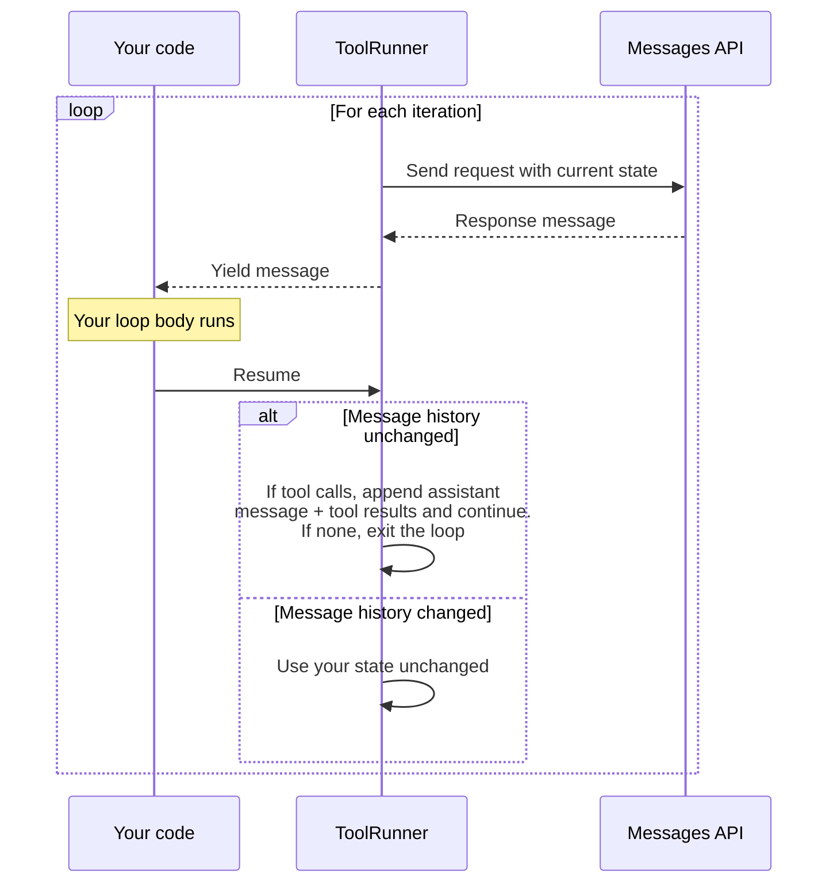

# Tool runner (SDK)

Gunakan tool runner dari SDK untuk menangani loop agentik, pembungkusan error, dan keamanan tipe secara otomatis.

---

"Tool runner" (penjalan alat) menangani loop agentik, pembungkusan error, dan keamanan tipe sehingga Anda tidak perlu melakukannya. Ketika Anda memerlukan persetujuan human-in-the-loop, logging kustom, atau eksekusi bersyarat, gunakan [loop manual](/docs/id/agents-and-tools/tool-use/handle-tool-calls) sebagai gantinya.

Alih-alih menangani panggilan alat, hasil alat, dan manajemen percakapan secara manual, tool runner secara otomatis:

* Menjalankan alat ketika Claude memanggilnya
* Menangani siklus permintaan/respons
* Mengelola status percakapan
* Menyediakan keamanan tipe dan validasi

<Note>
  Tool runner berada dalam tahap beta dan tersedia di [Python SDK](https://github.com/anthropics/anthropic-sdk-python/blob/main/tools.md), [TypeScript SDK](https://github.com/anthropics/anthropic-sdk-typescript/blob/main/helpers.md#tool-helpers), [C# SDK](https://github.com/anthropics/anthropic-sdk-csharp/blob/main/examples/ToolRunnerExample/Program.cs), [Go SDK](https://github.com/anthropics/anthropic-sdk-go/blob/main/tools.md), [Java SDK](https://github.com/anthropics/anthropic-sdk-java/blob/main/anthropic-java-example/src/main/java/com/anthropic/example/BetaToolRunnerExample.java), [PHP SDK](https://github.com/anthropics/anthropic-sdk-php/blob/main/examples/beta/beta_tool_runner.php), dan [Ruby SDK](https://github.com/anthropics/anthropic-sdk-ruby/blob/main/helpers.md#3-auto-looping-tool-runner-beta).
</Note>

## Penggunaan dasar

Definisikan alat menggunakan helper SDK, lalu gunakan tool runner untuk menjalankannya.

Bergantung pada signature alat di SDK, sebuah alat mengembalikan hasilnya sebagai string atau sebagai blok konten (blok teks, gambar, atau dokumen), sehingga sebuah alat dapat mengembalikan hasil multimodal. String yang dikembalikan menjadi satu blok konten teks. Untuk mengembalikan data terstruktur, seperti objek JSON atau angka, enkode terlebih dahulu sebagai string.

<Tabs>
  <Tab title="Python">
    Gunakan dekorator `@beta_tool` untuk mendefinisikan alat dengan type hint dan docstring.

    <Note>
      Jika Anda menggunakan klien async, ganti `@beta_tool` dengan `@beta_async_tool` dan definisikan fungsi dengan `async def`.
    </Note>

    ```python
    import json
    from anthropic import Anthropic, beta_tool

    client = Anthropic()


    @beta_tool
    def get_weather(location: str, unit: str = "fahrenheit") -> str:
        """Get the current weather in a given location.

        Args:
            location: The city and state, e.g. San Francisco, CA
            unit: Temperature unit, either 'celsius' or 'fahrenheit'
        """
        return json.dumps({"temperature": "20°C", "condition": "Sunny"})


    @beta_tool
    def calculate_sum(a: int, b: int) -> str:
        """Add two numbers together.

        Args:
            a: First number
            b: Second number
        """
        return str(a + b)


    runner = client.beta.messages.tool_runner(
        model="claude-opus-4-8",
        max_tokens=1024,
        tools=[get_weather, calculate_sum],
        messages=[
            {
                "role": "user",
                "content": "What's the weather like in Paris? Also, what's 15 + 27?",
            }
        ],
    )
    for message in runner:
        print(message)
    ```

    Dekorator `@beta_tool` memeriksa argumen fungsi dan docstring untuk menurunkan skema JSON untuk Anda.
  </Tab>

  <Tab title="TypeScript">
    Gunakan `betaZodTool()` untuk definisi alat yang type-safe dengan validasi Zod, atau `betaTool()` untuk definisi berbasis JSON Schema.

    TypeScript menawarkan dua pendekatan untuk mendefinisikan alat:

    **Menggunakan Zod (direkomendasikan)** - Gunakan `betaZodTool()` untuk definisi alat yang type-safe dengan validasi Zod (memerlukan Zod 3.25.0 atau lebih tinggi):

    ```typescript
    import Anthropic from "@anthropic-ai/sdk";
    import { betaZodTool } from "@anthropic-ai/sdk/helpers/beta/zod";
    import { z } from "zod";

    const client = new Anthropic();

    const getWeatherTool = betaZodTool({
      name: "get_weather",
      description: "Get the current weather in a given location",
      inputSchema: z.object({
        location: z.string().describe("The city and state, e.g. San Francisco, CA"),
        unit: z.enum(["celsius", "fahrenheit"]).default("fahrenheit").describe("Temperature unit")
      }),
      run: async (input) => {
        return JSON.stringify({ temperature: "20°C", condition: "Sunny" });
      }
    });

    const finalMessage = await client.beta.messages.toolRunner({
      model: "claude-opus-4-8",
      max_tokens: 1024,
      tools: [getWeatherTool],
      messages: [{ role: "user", content: "What's the weather like in Paris?" }]
    });

    for (const block of finalMessage.content) {
      if (block.type === "text") {
        console.log(block.text);
      }
    }
    ```

    **Menggunakan JSON Schema** - Gunakan `betaTool()` untuk definisi alat yang type-safe tanpa Zod:

    <Note>
      Input yang dihasilkan oleh Claude tidak divalidasi saat runtime. Lakukan validasi di dalam fungsi `run` jika diperlukan.
    </Note>

    ```typescript
    import Anthropic from "@anthropic-ai/sdk";
    import { betaTool } from "@anthropic-ai/sdk/helpers/beta/json-schema";

    const client = new Anthropic();

    const calculateSumTool = betaTool({
      name: "calculate_sum",
      description: "Add two numbers together",
      inputSchema: {
        type: "object",
        properties: {
          a: { type: "number", description: "First number" },
          b: { type: "number", description: "Second number" }
        },
        required: ["a", "b"]
      },
      run: async (input) => {
        return String(input.a + input.b);
      }
    });

    const finalMessage = await client.beta.messages.toolRunner({
      model: "claude-opus-4-8",
      max_tokens: 1024,
      tools: [calculateSumTool],
      messages: [{ role: "user", content: "What's 15 + 27?" }]
    });

    for (const block of finalMessage.content) {
      if (block.type === "text") {
        console.log(block.text);
      }
    }
    ```
  </Tab>

  <Tab title="C#">
    Definisikan setiap alat sebagai `BetaRunnableTool`, dengan menyediakan `Definition` yang berisi skema JSON dan delegate `Run` yang berjalan ketika Claude memanggil alat tersebut.

    ```csharp
    using System.Text.Json;
    using Anthropic;
    using Anthropic.Helpers.Beta;
    using Anthropic.Models.Beta.Messages;
    using MessageCreateParams = Anthropic.Models.Beta.Messages.MessageCreateParams;
    using InputSchema = Anthropic.Models.Beta.Messages.InputSchema;
    using Role = Anthropic.Models.Beta.Messages.Role;
    using Model = Anthropic.Models.Messages.Model;

    var client = new AnthropicClient();

    var getWeatherTool = new BetaRunnableTool
    {
        Name = "get_weather",
        Definition = new BetaTool
        {
            Name = "get_weather",
            Description = "Get the current weather in a given location.",
            InputSchema = new InputSchema
            {
                Properties = new Dictionary<string, JsonElement>
                {
                    ["location"] = JsonSerializer.SerializeToElement(
                        new { type = "string", description = "The city and state, e.g. San Francisco, CA" }
                    ),
                },
                Required = ["location"],
            },
        },
        Run = (toolUse, _) =>
        {
            var location = toolUse.Input["location"].GetString();
            return Task.FromResult<BetaToolResultBlockParamContent>(
                $"Weather in {location}: 20°C, sunny"
            );
        },
    };

    var calculateSumTool = new BetaRunnableTool
    {
        Name = "calculate_sum",
        Definition = new BetaTool
        {
            Name = "calculate_sum",
            Description = "Add two numbers together.",
            InputSchema = new InputSchema
            {
                Properties = new Dictionary<string, JsonElement>
                {
                    ["a"] = JsonSerializer.SerializeToElement(new { type = "number" }),
                    ["b"] = JsonSerializer.SerializeToElement(new { type = "number" }),
                },
                Required = ["a", "b"],
            },
        },
        Run = (toolUse, _) =>
        {
            var a = toolUse.Input["a"].GetDouble();
            var b = toolUse.Input["b"].GetDouble();
            return Task.FromResult<BetaToolResultBlockParamContent>($"{a + b}");
        },
    };

    var runner = client.Beta.Messages.ToolRunner(
        new MessageCreateParams
        {
            Model = Model.ClaudeOpus4_8,
            MaxTokens = 1024,
            Messages =
            [
                new()
                {
                    Role = Role.User,
                    Content = "What's the weather like in Paris? Also, what's 15 + 27?",
                },
            ],
        },
        [getWeatherTool, calculateSumTool]
    );

    await foreach (var message in runner)
    {
        Console.WriteLine(message);
    }
    ```
  </Tab>

  <Tab title="Go">
    Definisikan alat dengan `toolrunner.NewBetaToolFromJSONSchema`. Tipe input handler adalah struct dengan tag `jsonschema:`. SDK melakukan refleksi terhadapnya untuk menghasilkan skema JSON.

    ```go
    package main

    import (
    	"context"
    	"fmt"
    	"log"

    	"github.com/anthropics/anthropic-sdk-go"
    	"github.com/anthropics/anthropic-sdk-go/toolrunner"
    )

    type GetWeatherInput struct {
    	Location string `json:"location" jsonschema:"required,description=The city and state, e.g. San Francisco, CA"`
    	Unit     string `json:"unit,omitempty" jsonschema:"enum=celsius,enum=fahrenheit,description=Temperature unit"`
    }

    type CalculateSumInput struct {
    	A int `json:"a" jsonschema:"required,description=First number"`
    	B int `json:"b" jsonschema:"required,description=Second number"`
    }

    func main() {
    	client := anthropic.NewClient()
    	ctx := context.Background()

    	getWeather, err := toolrunner.NewBetaToolFromJSONSchema(
    		"get_weather",
    		"Get the current weather in a given location.",
    		func(ctx context.Context, input GetWeatherInput) (anthropic.BetaToolResultBlockParamContentUnion, error) {
    			return anthropic.BetaToolResultBlockParamContentUnion{
    				OfText: &anthropic.BetaTextBlockParam{Text: "20°C, Sunny"},
    			}, nil
    		},
    	)
    	if err != nil {
    		log.Fatal(err)
    	}

    	calculateSum, err := toolrunner.NewBetaToolFromJSONSchema(
    		"calculate_sum",
    		"Add two numbers together.",
    		func(ctx context.Context, input CalculateSumInput) (anthropic.BetaToolResultBlockParamContentUnion, error) {
    			return anthropic.BetaToolResultBlockParamContentUnion{
    				OfText: &anthropic.BetaTextBlockParam{Text: fmt.Sprintf("%d", input.A+input.B)},
    			}, nil
    		},
    	)
    	if err != nil {
    		log.Fatal(err)
    	}

    	runner := client.Beta.Messages.NewToolRunner(
    		[]anthropic.BetaTool{getWeather, calculateSum},
    		anthropic.BetaToolRunnerParams{
    			BetaMessageNewParams: anthropic.BetaMessageNewParams{
    				Model:     anthropic.ModelClaudeOpus4_8,
    				MaxTokens: 1024,
    				Messages: []anthropic.BetaMessageParam{
    					anthropic.NewBetaUserMessage(anthropic.NewBetaTextBlock(
    						"What's the weather like in Paris? Also, what's 15 + 27?",
    					)),
    				},
    			},
    		},
    	)

    	for message, err := range runner.All(ctx) {
    		if err != nil {
    			log.Fatal(err)
    		}
    		fmt.Println(message)
    	}
    }
    ```

    Tag struct `jsonschema:` menghasilkan skema input. Sebagai contoh, `CalculateSumInput` menjadi:

    ```json
    {
      "name": "calculate_sum",
      "description": "Add two numbers together.",
      "input_schema": {
        "type": "object",
        "properties": {
          "a": { "type": "integer", "description": "First number" },
          "b": { "type": "integer", "description": "Second number" }
        },
        "required": ["a", "b"]
      }
    }
    ```
  </Tab>

  <Tab title="Java">
    Definisikan setiap alat sebagai kelas yang mengimplementasikan `Supplier<String>`. Anotasikan kelas dengan `@JsonClassDescription` untuk deskripsi alat, dan setiap field publik dengan `@JsonPropertyDescription` untuk deskripsi parameter. SDK menurunkan skema JSON, nama alat (nama kelas dalam format snake-case), dan parsing input dari kelas tersebut, serta menandai alat dengan `strict: true` ([strict tool use](/docs/id/agents-and-tools/tool-use/strict-tool-use)).

    ```java
    import com.anthropic.client.AnthropicClient;
    import com.anthropic.client.okhttp.AnthropicOkHttpClient;
    import com.anthropic.helpers.BetaToolRunner;
    import com.anthropic.models.beta.messages.BetaMessage;
    import com.anthropic.models.beta.messages.MessageCreateParams;
    import com.anthropic.models.messages.Model;
    import com.fasterxml.jackson.annotation.JsonClassDescription;
    import com.fasterxml.jackson.annotation.JsonPropertyDescription;
    import java.util.function.Supplier;

    @JsonClassDescription("Get the current weather in a given location")
    static class GetWeather implements Supplier<String> {
        @JsonPropertyDescription("The city and state, e.g. San Francisco, CA")
        public String location;

        @JsonPropertyDescription("Temperature unit, either 'celsius' or 'fahrenheit'")
        public String unit;

        @Override
        public String get() {
            return "{\"temperature\": \"20°C\", \"condition\": \"Sunny\"}";
        }
    }

    @JsonClassDescription("Add two numbers together")
    static class CalculateSum implements Supplier<String> {
        @JsonPropertyDescription("First number")
        public double a;

        @JsonPropertyDescription("Second number")
        public double b;

        @Override
        public String get() {
            return String.valueOf(a + b);
        }
    }

    void main() {
        AnthropicClient client = AnthropicOkHttpClient.fromEnv();

        BetaToolRunner runner = client.beta()
                .messages()
                .toolRunner(MessageCreateParams.builder()
                        .model(Model.CLAUDE_OPUS_4_8)
                        .maxTokens(1024)
                        .addBeta("structured-outputs-2025-11-13")
                        .addUserMessage("What's the weather like in Paris? Also, what's 15 + 27?")
                        .addTool(GetWeather.class)
                        .addTool(CalculateSum.class)
                        .build());

        for (BetaMessage message : runner) {
            IO.println(message);
        }
    }
    ```

    Nama kelas `CalculateSum` menjadi nama alat `calculate_sum`, dan SDK menghasilkan skema JSON dari field yang dianotasi:

    ```json
    {
      "name": "calculate_sum",
      "description": "Add two numbers together",
      "input_schema": {
        "type": "object",
        "properties": {
          "a": { "description": "First number", "type": "number" },
          "b": { "description": "Second number", "type": "number" }
        },
        "required": ["a", "b"],
        "additionalProperties": false
      },
      "strict": true
    }
    ```
  </Tab>

  <Tab title="PHP">
    Definisikan setiap alat sebagai `BetaRunnableTool` yang memasangkan definisi skema JSON alat dengan closure yang menjalankannya.

    ```php
    <?php

    use Anthropic\Client;
    use Anthropic\Lib\Tools\BetaRunnableTool;
    use Anthropic\Messages\Model;

    $client = new Client();

    $getWeather = new BetaRunnableTool(
        definition: [
            'name' => 'get_weather',
            'description' => 'Get the current weather in a given location.',
            'input_schema' => [
                'type' => 'object',
                'properties' => [
                    'location' => [
                        'type' => 'string',
                        'description' => 'The city and state, e.g. San Francisco, CA',
                    ],
                    'unit' => [
                        'type' => 'string',
                        'enum' => ['celsius', 'fahrenheit'],
                    ],
                ],
                'required' => ['location'],
            ],
        ],
        run: fn (array $input): string => json_encode([
            'temperature' => '20°C',
            'condition' => 'Sunny',
        ]),
    );

    $calculateSum = new BetaRunnableTool(
        definition: [
            'name' => 'calculate_sum',
            'description' => 'Add two numbers together.',
            'input_schema' => [
                'type' => 'object',
                'properties' => [
                    'a' => ['type' => 'number', 'description' => 'First number'],
                    'b' => ['type' => 'number', 'description' => 'Second number'],
                ],
                'required' => ['a', 'b'],
            ],
        ],
        run: fn (array $input): string => (string) ($input['a'] + $input['b']),
    );

    $runner = $client->beta->messages->toolRunner(
        maxTokens: 1024,
        messages: [
            ['role' => 'user', 'content' => "What's the weather like in Paris? Also, what's 15 + 27?"],
        ],
        model: Model::CLAUDE_OPUS_4_8,
        tools: [$getWeather, $calculateSum],
    );

    foreach ($runner as $message) {
        foreach ($message->content as $block) {
            if ($block->type === 'text') {
                echo $block->text, "\n";
            } elseif ($block->type === 'tool_use') {
                echo "[Tool call: {$block->name}]\n";
            }
        }
    }
    ```
  </Tab>

  <Tab title="Ruby">
    Gunakan kelas `Anthropic::BaseTool` untuk mendefinisikan alat dengan skema input bertipe.

    ```ruby
    require "anthropic"

    # Inisialisasi klien
    client = Anthropic::Client.new

    # Definisikan skema input
    class GetWeatherInput < Anthropic::BaseModel
      required :location, String, doc: "The city and state, e.g. San Francisco, CA"
      optional :unit, Anthropic::InputSchema::EnumOf["celsius", "fahrenheit"],
               doc: "Temperature unit"
    end

    # Definisikan alat
    class GetWeather < Anthropic::BaseTool
      doc "Get the current weather in a given location"
      input_schema GetWeatherInput

      def call(input)
        # Dalam implementasi lengkap, Anda akan memanggil API cuaca di sini
        JSON.generate({temperature: "20°C", condition: "Sunny"})
      end
    end

    class CalculateSumInput < Anthropic::BaseModel
      required :a, Integer, doc: "First number"
      required :b, Integer, doc: "Second number"
    end

    class CalculateSum < Anthropic::BaseTool
      doc "Add two numbers together"
      input_schema CalculateSumInput

      def call(input)
        (input.a + input.b).to_s
      end
    end

    # Gunakan tool runner
    runner = client.beta.messages.tool_runner(
      model: "claude-opus-4-8",
      max_tokens: 1024,
      tools: [GetWeather.new, CalculateSum.new],
      messages: [
        {role: "user", content: "What's the weather like in Paris? Also, what's 15 + 27?"}
      ]
    )

    runner.each_message do |message|
      message.content.each do |block|
        puts block.text if block.type == :text
      end
    end
    ```

    Kelas `Anthropic::BaseTool` menggunakan metode `doc` untuk deskripsi alat dan `input_schema` untuk mendefinisikan parameter yang diharapkan. SDK secara otomatis mengonversi ini ke format skema JSON yang sesuai.
  </Tab>
</Tabs>

## Melakukan iterasi pada tool runner

Tool runner adalah iterable yang menghasilkan pesan dari Claude. Pada setiap iterasi, runner memeriksa apakah Claude meminta penggunaan alat. Jika ya, runner menjalankan alat tersebut dan mengirimkan hasilnya kembali ke Claude secara otomatis, lalu menghasilkan pesan berikutnya dari Claude untuk melanjutkan loop Anda.

Anda dapat mengakhiri loop pada iterasi mana pun dengan pernyataan `break`. Runner terus melakukan loop hingga Claude mengembalikan pesan tanpa penggunaan alat, atau hingga mencapai `max_iterations` jika Anda mengaturnya.

Jika Anda tidak memerlukan pesan perantara, Anda dapat langsung mendapatkan pesan akhir:

<Tabs>
  <Tab title="Python">
    Gunakan `runner.until_done()` untuk mendapatkan pesan akhir.

    ```python
    client = anthropic.Anthropic()
    # ...
    runner = client.beta.messages.tool_runner(
        model="claude-opus-4-8",
        max_tokens=1024,
        tools=[get_weather, calculate_sum],
        messages=[
            {
                "role": "user",
                "content": "What's the weather like in Paris? Also, what's 15 + 27?",
            }
        ],
    )
    final_message = runner.until_done()
    for block in final_message.content:
        if block.type == "text":
            print(block.text)
    ```
  </Tab>

  <Tab title="TypeScript">
    Gunakan `await` pada runner untuk mendapatkan pesan akhir.

    ```typescript
    const client = new Anthropic();
    // ...
    const runner = client.beta.messages.toolRunner({
      model: "claude-opus-4-8",
      max_tokens: 1024,
      tools: [getWeatherTool],
      messages: [{ role: "user", content: "What's the weather like in Paris?" }]
    });

    const finalMessage = await runner;
    for (const block of finalMessage.content) {
      if (block.type === "text") {
        console.log(block.text);
      }
    }
    ```
  </Tab>

  <Tab title="C#">
    Gunakan `runner.RunUntilDoneAsync()` untuk mendapatkan pesan akhir.

    ```csharp
    var client = new AnthropicClient();
    // ...
    var runner = client.Beta.Messages.ToolRunner(
        new MessageCreateParams
        {
            Model = Model.ClaudeOpus4_8,
            MaxTokens = 1024,
            Messages =
            [
                new()
                {
                    Role = Role.User,
                    Content = "What's the weather like in Paris?",
                },
            ],
        },
        [getWeatherTool]
    );

    var finalMessage = await runner.RunUntilDoneAsync();
    foreach (var block in finalMessage.Content)
    {
        if (block.TryPickText(out var textBlock))
        {
            Console.WriteLine(textBlock.Text);
        }
    }
    ```
  </Tab>

  <Tab title="Go">
    Gunakan `runner.RunToCompletion(ctx)` untuk mendapatkan pesan akhir.

    ```go
    client := anthropic.NewClient()
    ctx := context.Background()
    // ...
    runner := client.Beta.Messages.NewToolRunner(
    	[]anthropic.BetaTool{getWeather},
    	anthropic.BetaToolRunnerParams{
    		BetaMessageNewParams: anthropic.BetaMessageNewParams{
    			Model:     anthropic.ModelClaudeOpus4_8,
    			MaxTokens: 1024,
    			Messages: []anthropic.BetaMessageParam{
    				anthropic.NewBetaUserMessage(anthropic.NewBetaTextBlock(
    					"What's the weather like in Paris?",
    				)),
    			},
    		},
    	},
    )

    finalMessage, err := runner.RunToCompletion(ctx)
    if err != nil {
    	log.Fatal(err)
    }
    for _, block := range finalMessage.Content {
    	if textBlock, ok := block.AsAny().(anthropic.BetaTextBlock); ok {
    		fmt.Println(textBlock.Text)
    	}
    }
    ```
  </Tab>

  <Tab title="Java">
    Java SDK tidak memiliki pintasan `until_done()`. Lakukan iterasi hingga habis dan simpan pesan terakhir.

    ```java
    AnthropicClient client = AnthropicOkHttpClient.fromEnv();

    BetaToolRunner runner = client.beta()
            .messages()
            .toolRunner(MessageCreateParams.builder()
                    .model(Model.CLAUDE_OPUS_4_8)
                    .maxTokens(1024)
                    .addBeta("structured-outputs-2025-11-13")
                    .addUserMessage("What's the weather like in Paris? Also, what's 15 + 27?")
                    .addTool(GetWeather.class)
                    .addTool(CalculateSum.class)
                    .build());

    BetaMessage finalMessage = null;
    for (BetaMessage message : runner) {
        finalMessage = message;
    }
    for (BetaContentBlock block : finalMessage.content()) {
        block.text().ifPresent(textBlock -> IO.println(textBlock.text()));
    }
    ```
  </Tab>

  <Tab title="PHP">
    Gunakan `runUntilDone()` untuk mendapatkan pesan akhir.

    ```php
    $client = new Client();
    // ...
    $runner = $client->beta->messages->toolRunner(
        maxTokens: 1024,
        messages: [
            ['role' => 'user', 'content' => "What's the weather like in Paris? Also, what's 15 + 27?"],
        ],
        model: Model::CLAUDE_OPUS_4_8,
        tools: [$getWeather, $calculateSum],
    );

    $finalMessage = $runner->runUntilDone();
    foreach ($finalMessage->content as $block) {
        if ($block->type === 'text') {
            echo $block->text, "\n";
        }
    }
    ```
  </Tab>

  <Tab title="Ruby">
    Gunakan `runner.run_until_finished` untuk mendapatkan semua pesan.

    ```ruby
    client = Anthropic::Client.new
    # ...
    runner = client.beta.messages.tool_runner(
      model: "claude-opus-4-8",
      max_tokens: 1024,
      tools: [GetWeather.new, CalculateSum.new],
      messages: [
        {role: "user", content: "What's the weather like in Paris? Also, what's 15 + 27?"}
      ]
    )

    all_messages = runner.run_until_finished
    all_messages.each { |msg| puts msg.content }
    ```
  </Tab>
</Tabs>

## Penggunaan lanjutan

Di dalam loop, Anda dapat membaca setiap pesan respons dan memodifikasi status runner sebelum panggilan API berikutnya. Setiap iterasi mengikuti siklus hidup berikut:

1. Runner mengirimkan permintaan ke Messages API dengan status saat ini.

2. Runner menghasilkan pesan respons ke badan loop Anda.

3. Badan loop Anda berjalan. Anda dapat membaca pesan dan secara opsional memodifikasi status runner.

4. Ketika badan loop Anda selesai, runner memeriksa apakah Anda memodifikasi riwayat pesannya.

   * **Jika Anda tidak memodifikasi riwayat pesan:** Jika pesan berisi panggilan alat, runner menambahkan pesan asisten dan hasil alat, lalu melanjutkan. Jika tidak ada panggilan alat, loop berakhir.
   * **Jika Anda memodifikasi riwayat pesan:** Runner melewati penambahan otomatisnya dan menggunakan status Anda tanpa perubahan. Lihat [Mengambil alih riwayat pesan](#taking-over-message-history).



### Mengambil alih riwayat pesan

Secara default, runner mengelola status percakapan untuk Anda: setelah setiap giliran panggilan alat, runner menambahkan pesan asisten dan hasil alat apa pun ke riwayat pesannya sendiri. Anda mengambil alih riwayat pesan ketika Anda ingin mengulang sebuah giliran (membuang respons dan mengirim ulang), menyisipkan pesan lanjutan, atau membangun hasil alat sendiri.

Anda mengambil alih dengan memodifikasi pesan runner dari dalam badan loop. Metode pastinya bergantung pada SDK. Lihat tab per bahasa berikut.

Ketika Anda mengambil alih untuk sebuah iterasi, runner tidak menambahkan pesan asisten atau hasil alat dari giliran tersebut. Anda menjadi bertanggung jawab untuk menjaga percakapan tetap valid: tambahkan pesan asisten dan hasil alat sendiri (jika Anda ingin giliran tersebut dihitung), modifikasi status secara bersyarat agar loop masih dapat berakhir ketika tidak ada panggilan alat, dan berikan `max_iterations` untuk membatasi loop. Ketujuh SDK mendukung `max_iterations`.

<Tabs>
  <Tab title="Python">
    Gunakan `generate_tool_call_response()` untuk memeriksa atau menghitung hasil alat. Memanggil `append_messages()` di dalam loop memberi tahu runner bahwa Anda mengelola riwayat sendiri, jadi sertakan pesan asisten dan hasil alat dalam apa yang Anda tambahkan.

    ```python
    runner = client.beta.messages.tool_runner(
        model="claude-opus-4-8",
        max_tokens=1024,
        max_iterations=10,
        tools=[get_weather],
        messages=[{"role": "user", "content": "What's the weather in San Francisco?"}],
    )

    for message in runner:
        tool_response = runner.generate_tool_call_response()
        if tool_response is not None:
            # append_messages() menandai state sebagai dimodifikasi, jadi runner melewati
            # append otomatisnya untuk iterasi ini. Tambahkan sendiri pesan asisten dan
            # tool result, beserta tindak lanjut apa pun.
            runner.append_messages(
                message,
                tool_response,
                {"role": "user", "content": "Please be concise."},
            )
        # Jika tidak ada pemanggilan alat, biarkan state tidak tersentuh agar loop keluar.
    ```

    Untuk mengubah parameter permintaan seperti `max_tokens` tanpa mengambil alih riwayat pesan, gunakan `set_messages_params()`. Runner tetap menambahkan pesan asisten dan hasil alat secara otomatis.

    ```python
    for message in runner:
        runner.set_messages_params(lambda params: {**params, "max_tokens": 2048})
    ```
  </Tab>

  <Tab title="TypeScript">
    Gunakan `runner.params` untuk membaca parameter permintaan saat ini dan `setMessagesParams()` untuk menggantinya. Memanggil `setMessagesParams()` atau `pushMessages()` di dalam loop memberi tahu runner bahwa Anda mengelola status sendiri: pesan asisten dan hasil alat dari iterasi ini dibuang, dan permintaan berikutnya dikirim dengan status Anda.

    Contoh berikut mengulang respons yang terpotong dengan anggaran `max_tokens` yang lebih besar.

    ```typescript
    const runner = client.beta.messages.toolRunner({
      model: "claude-opus-4-8",
      max_tokens: 1024,
      max_iterations: 10,
      tools: [getWeatherTool],
      messages: [
        {
          role: "user",
          content: "Give me a detailed weather report for every major US city."
        }
      ]
    });

    const MAX_TOKEN_CEILING = 8192;

    for await (const message of runner) {
      if (message.stop_reason === "max_tokens") {
        const current = runner.params.max_tokens;
        if (current >= MAX_TOKEN_CEILING) {
          console.warn(`Hit ceiling (${MAX_TOKEN_CEILING}); stopping.`);
          break;
        }
        const doubled = Math.min(current * 2, MAX_TOKEN_CEILING);
        console.log(`Response truncated at ${current} tokens; retrying with ${doubled}.`);
        // Naikkan anggaran. setMessagesParams() menandai state sebagai dimodifikasi, jadi
        // runner TIDAK menambahkan pesan yang terpotong. Iterasi berikutnya mencoba ulang
        // giliran yang sama dengan anggaran yang lebih besar.
        runner.setMessagesParams((params) => ({ ...params, max_tokens: doubled }));
      }
      // Jika tidak, biarkan state tak tersentuh agar runner menambahkan otomatis dan lanjut.
    }
    ```
  </Tab>

  <Tab title="C#">
    Memanggil `SetParams()` atau `PushMessages()` menandai status sebagai dimodifikasi, yang menyebabkan runner melewati penambahan otomatisnya untuk giliran tersebut. Runner C# tetap menjalankan alat yang cocok untuk giliran tersebut dan membuang hasil yang dibangun secara otomatis, sehingga alat yang juga Anda jalankan sendiri di dalam badan loop akan berjalan dua kali kecuali Anda memperhitungkannya. Ketika Anda mengambil alih, dorong pesan asisten dan hasil alat sendiri. Jika tidak, percakapan tidak akan membuat kemajuan. Runner C# selalu berakhir ketika respons tidak memiliki panggilan alat, jadi buat mutasi status apa pun bersyarat pada keberadaan blok `tool_use`.

    ```csharp
    var runner = client.Beta.Messages.ToolRunner(
        new MessageCreateParams
        {
            Model = Model.ClaudeOpus4_8,
            MaxTokens = 1024,
            Messages = [new() { Role = Role.User, Content = "What's the weather in San Francisco?" }],
        },
        [getWeatherTool],
        maxIterations: 10
    );

    await foreach (var message in runner)
    {
        var toolUseBlock = message
            .Content.Select(block => block.TryPickToolUse(out var toolUse) ? toolUse : null)
            .FirstOrDefault(toolUse => toolUse is not null);

        if (toolUseBlock is null)
        {
            // Tidak ada pemanggilan alat: biarkan state tidak tersentuh agar loop keluar secara normal.
            continue;
        }

        // Jalankan alat sendiri dan bangun blok hasilnya.
        var toolResult = new BetaToolResultBlockParam(toolUseBlock.ID)
        {
            Content = await getWeatherTool.ExecuteAsync(toolUseBlock, default),
        };

        // PushMessages() menandai state sebagai dimodifikasi; runner melewati auto-append-nya.
        // Berikan sendiri giliran asisten dan hasil alat, lalu tambahkan tindak lanjut.
        runner.PushMessages(
            new()
            {
                Role = Role.Assistant,
                Content = new BetaMessageParamContent(
                    JsonSerializer.SerializeToElement(
                        message.Content.Select(block => block.Json).ToArray()
                    )
                ),
            },
            new()
            {
                Role = Role.User,
                Content = new List<BetaContentBlockParam> { toolResult },
            },
            new() { Role = Role.User, Content = "Please be concise in your response." }
        );
    }
    ```
  </Tab>

  <Tab title="Go">
    Runner Go mengekspos parameter sebagai field publik `Params`. Memodifikasi `runner.Params` di antara panggilan ke `NextMessage(ctx)` berlaku untuk permintaan API berikutnya. Tidak seperti SDK lainnya, runner Go selalu menambahkan pesan asisten dan hasil alat tanpa syarat. Memodifikasi `Params` tidak menekan langkah tersebut.

    ```go
    runner := client.Beta.Messages.NewToolRunner(
    	[]anthropic.BetaTool{getWeather},
    	anthropic.BetaToolRunnerParams{
    		BetaMessageNewParams: anthropic.BetaMessageNewParams{
    			Model:     anthropic.ModelClaudeOpus4_8,
    			MaxTokens: 1024,
    			Messages: []anthropic.BetaMessageParam{
    				anthropic.NewBetaUserMessage(anthropic.NewBetaTextBlock(
    					"What's the weather in San Francisco?",
    				)),
    			},
    		},
    		MaxIterations: 10,
    	},
    )

    for {
    	message, err := runner.NextMessage(ctx)
    	if err != nil {
    		log.Fatal(err)
    	}
    	if message == nil {
    		break // conversation complete
    	}

    	// Runner Go selalu menambahkan pesan asisten dan hasil alat.
    	// Perubahan param di sini berlaku untuk iterasi berikutnya.
    	runner.Params.MaxTokens = 2048
    }
    ```
  </Tab>

  <Tab title="Java">
    Gunakan `runner.params()` untuk membaca parameter saat ini dan `runner.setNextParams()` untuk menggantinya pada iterasi berikutnya. Ketika Anda memanggil `setNextParams()` di dalam loop, runner melewati penambahan otomatisnya. Pesan yang baru saja dihasilkan dibuang, dan iterasi berikutnya mengirimkan parameter baru Anda tanpa perubahan.

    Contoh berikut mengulang giliran yang mencapai batas token dengan menggandakan `max_tokens`. Melakukan mutasi hanya pada cabang `max_tokens` menjaga loop tetap konvergen: giliran yang selesai secara normal akan lolos, dan runner menambahkan secara otomatis serta berakhir ketika tidak ada lagi panggilan alat.

    ```java
    BetaToolRunner runner = client.beta()
            .messages()
            .toolRunner(ToolRunnerCreateParams.builder()
                    .initialMessageParams(MessageCreateParams.builder()
                            .model(Model.CLAUDE_OPUS_4_8)
                            .maxTokens(1024)
                            .addBeta("structured-outputs-2025-11-13")
                            .addUserMessage("Give me a detailed weather report for every major US city.")
                            .addTool(GetWeather.class)
                            .build())
                    .maxIterations(10L)
                    .build());

    long ceiling = 8192;

    for (BetaMessage message : runner) {
        if (BetaStopReason.MAX_TOKENS.equals(message.stopReason().orElse(null))) {
            long current = runner.params().maxTokens();
            if (current >= ceiling) {
                IO.println("Hit ceiling (" + ceiling + "), accepting truncated response.");
                break;
            }
            long doubled = Math.min(current * 2, ceiling);
            IO.println("Response truncated at " + current + " tokens, retrying with " + doubled + ".");

            // Memanggil setNextParams() menandai giliran ini sebagai dikelola-pengguna: runner
            // TIDAK otomatis menambahkan pesan yang terpotong, sehingga iterasi berikutnya
            // mengirim ulang prefiks percakapan yang sama dengan anggaran yang lebih besar.
            runner.setNextParams(runner.params().toBuilder().maxTokens(doubled).build());
        }
        // Tidak ada mutasi pada giliran normal: runner otomatis menambahkan dan melanjutkan.
    }
    ```
  </Tab>

  <Tab title="PHP">
    Gunakan `setMessagesParams()` dan `pushMessages()` untuk memodifikasi status runner, dan `getParams()` untuk membacanya. Memanggil salah satu setter di dalam loop memberi tahu runner untuk melewati penambahan otomatisnya, sehingga percakapan berlanjut dari status yang Anda modifikasi.

    Contoh berikut menggandakan `max_tokens` dan mengulang ketika respons terpotong.

    ```php
    use Anthropic\Beta\Messages\BetaStopReason;

    $runner = $client->beta->messages->toolRunner(
        maxTokens: 1024,
        messages: [
            ['role' => 'user', 'content' => 'Give a detailed weather report for every major US city.'],
        ],
        model: Model::CLAUDE_OPUS_4_8,
        tools: [$getWeather],
        maxIterations: 10,
    );

    $maxTokenCeiling = 8192;

    foreach ($runner as $message) {
        if ($message->stopReason === BetaStopReason::MAX_TOKENS->value) {
            $current = $runner->getParams()['maxTokens'];

            if ($current >= $maxTokenCeiling) {
                echo "Hit ceiling ({$maxTokenCeiling}), accepting truncated response.\n";
                break;
            }

            $doubled = min($current * 2, $maxTokenCeiling);
            echo "Response truncated at {$current} tokens, retrying with {$doubled}.\n";

            // Memanggil setMessagesParams() di dalam loop memberi tahu runner untuk melewati
            // penambahan otomatisnya. Pesan yang terpotong dibuang; iterasi
            // berikutnya mencoba ulang dengan anggaran yang lebih besar.
            // Kunci menggunakan camelCase, sesuai dengan parameter bernama toolRunner().
            $runner->setMessagesParams(['maxTokens' => $doubled]);
        }
    }
    ```
  </Tab>

  <Tab title="Ruby">
    Gunakan `next_message` untuk kontrol langkah demi langkah. Pada saat `next_message` mengembalikan nilai, pesan asisten dan hasil alat untuk giliran tersebut sudah ditambahkan. Gunakan `feed_messages` untuk menyisipkan pesan lanjutan di antara giliran, dan `runner.params.update(...)` untuk mengubah parameter permintaan di tempat.

    Anda mengambil alih riwayat pesan ketika, dari dalam blok `each_message` atau `each_streaming`, Anda menetapkan ulang `runner.params[:messages]` atau memanggil `feed_messages`. Pola berikut memanggil `feed_messages` di antara panggilan `next_message`, yang tidak mengambil alih.

    ```ruby
    runner = client.beta.messages.tool_runner(
      model: "claude-opus-4-8",
      max_tokens: 1024,
      max_iterations: 10,
      tools: [GetWeather.new],
      messages: [{role: "user", content: "What's the weather in San Francisco?"}]
    )

    # Jalankan runner satu langkah. Pesan asisten dan hasil alat ditambahkan
    # ke runner.params[:messages] sebelum next_message kembali.
    message = runner.next_message
    puts message.content

    # Sisipkan tindak lanjut sebelum melanjutkan. feed_messages menerima splat, bukan array.
    runner.feed_messages({role: "user", content: "Also check Boston."})

    # Ubah parameter di tempat. Menetapkan ulang runner.params[:messages] mengambil alih
    # riwayat pesan hanya jika dilakukan di dalam blok each_message atau each_streaming.
    runner.params.update(max_tokens: 2048)

    runner.run_until_finished
    ```
  </Tab>
</Tabs>

### Manajemen konteks otomatis

Untuk tugas agentik yang berjalan lama, tool runner Python, TypeScript, dan Ruby mendukung [compaction](/docs/id/build-with-claude/context-editing#client-side-compaction-sdk) otomatis, yang menghasilkan ringkasan ketika penggunaan token melebihi ambang batas sehingga percakapan dapat berlanjut melampaui batas jendela konteks. Ketiga SDK tersebut telah menghentikan dukungan (deprecated) opsi sisi klien ini demi [context editing](/docs/id/build-with-claude/context-editing) sisi server, yang tersedia di setiap SDK. Tool runner Go, Java, C#, dan PHP tidak menyertakan compaction sisi klien.

### Melakukan debug eksekusi alat

Ketika sebuah alat melempar exception, tool runner menangkapnya dan mengembalikan error tersebut ke Claude sebagai hasil alat dengan `is_error: true`. Hasil alat membawa pesan exception (di Python, tipe dan pesannya), bukan stack trace lengkap.

Apa yang dicatat oleh SDK bersifat spesifik per bahasa. Python SDK mencatat exception lengkap, termasuk stack trace-nya, melalui modul `logging` standar setiap kali sebuah alat memunculkan exception yang tidak ditangani. SDK Python, TypeScript, dan Java membaca variabel lingkungan `ANTHROPIC_LOG` untuk mengaktifkan logging SDK, yang mencakup detail permintaan dan respons:

```bash
# Log pada level info
export ANTHROPIC_LOG=info

# Log pada level debug untuk output yang lebih rinci
export ANTHROPIC_LOG=debug
```

SDK Go, Ruby, C#, dan PHP tidak membaca `ANTHROPIC_LOG`. Di luar Python, tidak ada SDK yang mencatat alat yang gagal: untuk melihat mengapa sebuah alat gagal, tangkap dan catat exception di dalam fungsi alat sebelum mengembalikan atau melempar ulang exception tersebut.

### Mencegat error alat

Secara default, error alat diteruskan kembali ke Claude, yang kemudian dapat merespons dengan tepat. Namun, Anda mungkin ingin mendeteksi error dan menanganinya secara berbeda, misalnya, untuk menghentikan eksekusi lebih awal atau mengimplementasikan penanganan error kustom.

Di SDK Python dan TypeScript, gunakan metode respons alat (`generate_tool_call_response()` di Python, `generateToolResponse()` di TypeScript) untuk mencegat hasil alat dan memeriksa error sebelum dikirim ke Claude. SDK lainnya tidak mengekspos hook tersebut. Tab mereka menjelaskan alternatif terdekat:

<Tabs>
  <Tab title="Python">
    ```python
    client = anthropic.Anthropic()
    # ...
    runner = client.beta.messages.tool_runner(
        model="claude-opus-4-8",
        max_tokens=1024,
        tools=[my_tool],
        messages=[{"role": "user", "content": "Run my_tool with the query 'hello'."}],
    )

    for message in runner:
        tool_response = runner.generate_tool_call_response()

        if tool_response is not None:
            # tool_response adalah dict: {"role": "user", "content": [...]}
            # Periksa apakah ada hasil alat yang mengandung error
            for block in tool_response["content"]:
                if block.get("is_error"):
                    # Opsi 1: Lempar exception untuk menghentikan loop
                    raise RuntimeError(f"Tool failed: {json.dumps(block['content'])}")

                    # Opsi 2: Catat log dan lanjutkan (biarkan Claude menanganinya)
                    # logger.error(f"Tool error: {json.dumps(block['content'])}")

        # Proses pesan seperti biasa
        print(message.content)
    ```
  </Tab>

  <Tab title="TypeScript">
    ```typescript
    const client = new Anthropic();
    // ...
    const runner = client.beta.messages.toolRunner({
      model: "claude-opus-4-8",
      max_tokens: 1024,
      tools: [myTool],
      messages: [{ role: "user", content: "Run my_tool with the query 'hello'." }]
    });

    for await (const message of runner) {
      const toolResultMessage = await runner.generateToolResponse();

      if (toolResultMessage && typeof toolResultMessage.content !== "string") {
        // Periksa apakah ada hasil alat yang mengalami error
        for (const block of toolResultMessage.content) {
          if (block.type === "tool_result" && block.is_error) {
            // Opsi 1: Lempar (throw) untuk menghentikan loop
            throw new Error(`Tool failed: ${JSON.stringify(block.content)}`);

            // Opsi 2: Catat log dan lanjutkan (biarkan Claude menanganinya)
            // console.error(`Tool error: ${JSON.stringify(block.content)}`);
          }
        }
      }

      // Proses pesan seperti biasa
      console.log(message.content);
    }
    ```
  </Tab>

  <Tab title="C#">
    Tool runner C# tidak mengekspos hook untuk memeriksa hasil alat sebelum dikirim ke Claude. Untuk mengontrol konten error, lempar `BetaToolError` dari dalam badan alat. Runner mengonversinya menjadi `tool_result` dengan `is_error: true` dan konten yang Anda berikan.

    ```csharp
    var client = new AnthropicClient();

    var getWeatherTool = new BetaRunnableTool
    {
        Name = "get_weather",
        Definition = new BetaTool
        {
            Name = "get_weather",
            Description = "Get the current weather in a given location.",
            InputSchema = new InputSchema
            {
                Properties = new Dictionary<string, JsonElement>
                {
                    ["location"] = JsonSerializer.SerializeToElement(new { type = "string" }),
                },
                Required = ["location"],
            },
        },
        Run = async (toolUse, cancellationToken) =>
        {
            try
            {
                return await CallExternalWeatherService(
                    toolUse.Input["location"].GetString()!,
                    cancellationToken
                );
            }
            catch (HttpRequestException ex)
            {
                // Lakukan logging di sini jika Anda perlu memeriksa kegagalan tersebut sebelum Claude melihatnya.
                throw new BetaToolError($"Weather service unavailable: {ex.Message}");
            }
        },
    };

    var runner = client.Beta.Messages.ToolRunner(
        new MessageCreateParams
        {
            Model = Model.ClaudeOpus4_8,
            MaxTokens = 1024,
            Messages =
            [
                new() { Role = Role.User, Content = "What's the weather in San Francisco?" },
            ],
        },
        [getWeatherTool]
    );

    Console.WriteLine(await runner.RunUntilDoneAsync());
    ```
  </Tab>

  <Tab title="Go">
    Mencegat error alat sebelum dikirim ke Claude saat ini tidak didukung di Go SDK. Runner mengonversi error yang dikembalikan dari handler Anda menjadi hasil alat dengan `is_error: true` secara internal. Untuk menyesuaikan konten error, tangkap error di dalam handler Anda dan kembalikan hasil alih-alih mengembalikan error tersebut.
  </Tab>

  <Tab title="Java">
    Mencegat error alat sebelum dikirim ke Claude saat ini tidak didukung di Java SDK. Runner menangkap exception apa pun yang dilempar dari metode `get()` alat dan mengonversinya menjadi hasil alat dengan `is_error: true` secara otomatis. Untuk mengontrol konten error, tangkap exception di dalam alat Anda dan kembalikan string kustom.
  </Tab>

  <Tab title="PHP">
    Tool runner PHP saat ini tidak mengekspos hasil alat sebelum ditambahkan. Exception yang dilempar dari closure `run` sebuah alat ditangkap dan dikirim ke Claude sebagai hasil alat dengan `is_error: true` secara otomatis. Untuk memeriksa atau mengganti konten error, gunakan pola manual `pushMessages()` yang ditunjukkan di [Memodifikasi hasil alat](#modifying-tool-results).
  </Tab>

  <Tab title="Ruby">
    ```ruby
    client = Anthropic::Client.new
    # ...
    runner = client.beta.messages.tool_runner(
      model: "claude-opus-4-8",
      max_tokens: 1024,
      tools: [MyTool.new],
      messages: [{role: "user", content: "Run my_tool with the query 'hello'."}]
    )

    loop do
      message = runner.next_message
      break unless message

      # Pada saat next_message mengembalikan nilai, runner telah menjalankan alat-alat giliran ini dan
      # menambahkan hasilnya sebagai pesan terakhir (berperan user). Periksa hasilnya di sini,
      # sebelum permintaan berikutnya mengirimkannya ke Claude.
      tool_results = runner.params[:messages].last

      if tool_results && tool_results[:role] == :user && tool_results[:content].is_a?(Array)
        tool_results[:content].each do |block|
          if block[:type] == :tool_result && block[:is_error]
            # Opsi 1: Lempar exception untuk menghentikan loop
            raise "Tool failed: #{block[:content]}"

            # Opsi 2: Catat log dan lanjutkan (biarkan Claude menanganinya)
            # logger.error("Tool error: #{block[:content]}")
          end
        end
      end

      puts message.content
      break if message.stop_reason != :tool_use
    end
    ```
  </Tab>
</Tabs>

### Memodifikasi hasil alat

Anda dapat memodifikasi hasil alat sebelum dikirim kembali ke Claude. Ini berguna untuk menambahkan metadata seperti `cache_control` untuk mengaktifkan [caching prompt](/docs/id/build-with-claude/prompt-caching) pada hasil alat, atau untuk mentransformasi output alat.

Di SDK Python dan TypeScript, gunakan metode respons alat untuk mendapatkan hasil alat, lalu modifikasi sebelum runner melanjutkan. Apakah Anda secara eksplisit menambahkan hasil yang dimodifikasi atau memutasinya di tempat bergantung pada SDK. Lihat komentar kode di setiap tab.

<Tabs>
  <Tab title="Python">
    ```python
    client = anthropic.Anthropic()
    # ...
    runner = client.beta.messages.tool_runner(
        model="claude-opus-4-8",
        max_tokens=1024,
        tools=[search_documents],
        messages=[
            {
                "role": "user",
                "content": "Search for information about the climate of San Francisco",
            }
        ],
    )

    for message in runner:
        tool_response = runner.generate_tool_call_response()

        if tool_response is not None:
            # tool_response adalah dict: {"role": "user", "content": [...]}
            # Modifikasi hasil alat untuk menambahkan kontrol cache
            for block in tool_response["content"]:
                if block["type"] == "tool_result":
                    # Tambahkan cache_control untuk meng-cache hasil alat ini
                    block["cache_control"] = {"type": "ephemeral"}

            # Tambahkan respons yang telah dimodifikasi (ini mencegah penambahan otomatis respons asli)
            runner.append_messages(message, tool_response)

        print(message.content)
    ```
  </Tab>

  <Tab title="TypeScript">
    ```typescript
    const client = new Anthropic();
    // ...
    const runner = client.beta.messages.toolRunner({
      model: "claude-opus-4-8",
      max_tokens: 1024,
      tools: [searchDocuments],
      messages: [
        { role: "user", content: "Search for information about the climate of San Francisco" }
      ]
    });

    for await (const message of runner) {
      const toolResultMessage = await runner.generateToolResponse();

      if (toolResultMessage && typeof toolResultMessage.content !== "string") {
        // Modifikasi hasil alat untuk menambahkan kontrol cache
        for (const block of toolResultMessage.content) {
          if (block.type === "tool_result") {
            // Tambahkan cache_control untuk meng-cache hasil alat ini
            block.cache_control = { type: "ephemeral" };
          }
        }
        // Tidak perlu memanggil pushMessages: runner secara otomatis menambahkan baik pesan
        // asisten maupun respons alat yang di-cache (yang kini sudah dimutasi).
      }

      console.log(message.content);
    }
    ```
  </Tab>

  <Tab title="C#">
    Memodifikasi hasil alat sebelum ditambahkan (misalnya, untuk menambahkan `cache_control`) saat ini tidak didukung di C# SDK. Runner membangun blok `tool_result` secara internal dan tidak menyediakan hook untuk mengubahnya.
  </Tab>

  <Tab title="Go">
    Runner Go tidak mengekspos hook untuk memodifikasi blok `tool_result` terluar. Namun, Anda dapat mengatur `cache_control` pada blok konten bagian dalam yang dikembalikan oleh handler Anda.

    ```go
    client := anthropic.NewClient()
    ctx := context.Background()

    searchDocuments, err := toolrunner.NewBetaToolFromJSONSchema(
    	"search_documents",
    	"Search documents for relevant information.",
    	func(ctx context.Context, input SearchDocumentsInput) (anthropic.BetaToolResultBlockParamContentUnion, error) {
    		return anthropic.BetaToolResultBlockParamContentUnion{
    			OfText: &anthropic.BetaTextBlockParam{
    				Text: fmt.Sprintf("Found 3 documents matching: %s", input.Query),
    				// Setel cache_control pada blok konten bagian dalam. cache_control
    				// pada blok tool_result bagian luar saat ini belum
    				// dapat disetel melalui runner Go.
    				CacheControl: anthropic.NewBetaCacheControlEphemeralParam(),
    			},
    		}, nil
    	},
    )
    if err != nil {
    	log.Fatal(err)
    }

    runner := client.Beta.Messages.NewToolRunner(
    	[]anthropic.BetaTool{searchDocuments},
    	anthropic.BetaToolRunnerParams{
    		BetaMessageNewParams: anthropic.BetaMessageNewParams{
    			Model:     anthropic.ModelClaudeOpus4_8,
    			MaxTokens: 1024,
    			Messages: []anthropic.BetaMessageParam{
    				anthropic.NewBetaUserMessage(anthropic.NewBetaTextBlock(
    					"Search for information about the climate of San Francisco",
    				)),
    			},
    		},
    	},
    )

    finalMessage, err := runner.RunToCompletion(ctx)
    if err != nil {
    	log.Fatal(err)
    }
    fmt.Println(finalMessage)
    ```
  </Tab>

  <Tab title="Java">
    Untuk mengatur `cache_control` pada hasil alat, kembalikan `BetaToolResultBlockParam.Content` dari alat alih-alih `String` dan atur `cacheControl` pada blok teks bagian dalam. Runner saat ini tidak mendukung pengaturan `cache_control` pada blok `tool_result` terluar.

    ```java
    @JsonClassDescription("Look up reference documentation for a topic")
    static class SearchDocuments implements Supplier<BetaToolResultBlockParam.Content> {
        @JsonPropertyDescription("The search query")
        public String query;

        @Override
        public BetaToolResultBlockParam.Content get() {
            String largeResult = "..."; // a long document worth caching
            return BetaToolResultBlockParam.Content.ofBlocks(List.of(
                    BetaToolResultBlockParam.Content.Block.ofText(
                            BetaTextBlockParam.builder()
                                    .text(largeResult)
                                    .cacheControl(BetaCacheControlEphemeral.builder().build())
                                    .build())));
        }
    }
    ```
  </Tab>

  <Tab title="PHP">
    Tool runner PHP tidak memiliki callback untuk memutasi blok `tool_result` yang dihasilkan secara otomatis. Untuk menambahkan field seperti `cache_control`, bangun hasil alat sendiri dan dorong hasilnya. Memanggil `pushMessages()` melewati penambahan otomatis runner untuk giliran tersebut.

    ```php
    $client = new Client();
    // ...
    $runner = $client->beta->messages->toolRunner(
        maxTokens: 1024,
        messages: [
            ['role' => 'user', 'content' => 'Search for information about the climate of San Francisco.'],
        ],
        model: Model::CLAUDE_OPUS_4_8,
        tools: [$searchDocuments],
    );

    foreach ($runner as $message) {
        $toolResults = [];
        foreach ($message->content as $block) {
            if ($block instanceof BetaToolUseBlock) {
                $toolResults[] = [
                    'type' => 'tool_result',
                    'tool_use_id' => $block->id,
                    'content' => $searchDocuments->run($block->input),
                    // Tambahkan cache_control untuk menyimpan hasil alat ini ke cache
                    'cache_control' => ['type' => 'ephemeral'],
                ];
            }
        }

        if ($toolResults !== []) {
            // pushMessages() menandai state sebagai telah dimutasi, sehingga runner melewati
            // penambahan otomatisnya. Push pesan asisten dan hasil alat.
            $runner->pushMessages(
                ['role' => 'assistant', 'content' => $message->content],
                ['role' => 'user', 'content' => $toolResults],
            );
        }
        // Tidak ada panggilan alat: biarkan state tidak berubah agar loop berhenti.
    }
    ```
  </Tab>

  <Tab title="Ruby">
    ```ruby
    client = Anthropic::Client.new
    # ...
    runner = client.beta.messages.tool_runner(
      model: "claude-opus-4-8",
      max_tokens: 1024,
      tools: [SearchDocuments.new],
      messages: [{role: "user", content: "Search for information about the climate of San Francisco"}]
    )

    loop do
      message = runner.next_message
      break unless message

      # Akses hasil alat terbaru dari array messages
      # Runner secara otomatis menambahkan hasil alat, tetapi Anda dapat memodifikasinya
      tool_results_message = runner.params[:messages].last

      if tool_results_message && tool_results_message[:role] == :user && tool_results_message[:content].is_a?(Array)
        tool_results_message[:content].each do |block|
          if block[:type] == :tool_result
            # Modifikasi hasil alat untuk menambahkan cache control
            block[:cache_control] = {type: "ephemeral"}
          end
        end
      end

      puts message.content
      break if message.stop_reason != :tool_use
    end
    ```
  </Tab>
</Tabs>

<Tip>
  Menambahkan `cache_control` ke hasil alat sangat berguna ketika alat mengembalikan data dalam jumlah besar (seperti hasil pencarian dokumen) yang ingin Anda cache untuk panggilan API berikutnya. Lihat [Caching prompt](/docs/id/build-with-claude/prompt-caching) untuk detail lebih lanjut tentang strategi caching.
</Tip>

## Streaming

Aktifkan streaming untuk memproses respons setiap giliran secara bertahap. Setiap iterasi menghasilkan objek stream yang dapat Anda iterasi untuk mendapatkan event.

<Tabs>
  <Tab title="Python">
    Atur `stream=True` dan gunakan `get_final_message()` untuk mendapatkan pesan yang terakumulasi.

    ```python
    client = anthropic.Anthropic()
    # ...
    runner = client.beta.messages.tool_runner(
        model="claude-opus-4-8",
        max_tokens=1024,
        tools=[calculate_sum],
        messages=[{"role": "user", "content": "What is 15 + 27?"}],
        stream=True,
    )

    # Saat streaming, runner mengembalikan BetaMessageStream
    for message_stream in runner:
        for event in message_stream:
            print("event:", event)
        print("message:", message_stream.get_final_message())

    print(runner.until_done())
    ```
  </Tab>

  <Tab title="TypeScript">
    Atur `stream: true` dan gunakan `finalMessage()` untuk mendapatkan pesan yang terakumulasi.

    ```typescript
    const client = new Anthropic();
    // ...
    const runner = client.beta.messages.toolRunner({
      model: "claude-opus-4-8",
      max_tokens: 1024,
      messages: [{ role: "user", content: "What is the weather in San Francisco?" }],
      tools: [getWeatherTool],
      stream: true
    });

    // Saat streaming, runner mengembalikan BetaMessageStream
    for await (const messageStream of runner) {
      for await (const event of messageStream) {
        console.log("event:", event);
      }
      console.log("message:", await messageStream.finalMessage());
    }

    console.log(await runner);
    ```
  </Tab>

  <Tab title="C#">
    Panggil `runner.Streaming()` untuk mendapatkan urutan async bersarang: satu stream bagian dalam untuk setiap panggilan API.

    ```csharp
    var client = new AnthropicClient();
    // ...
    var runner = client.Beta.Messages.ToolRunner(
        new MessageCreateParams
        {
            Model = Model.ClaudeOpus4_8,
            MaxTokens = 1024,
            Messages =
            [
                new() { Role = Role.User, Content = "What is 15 + 27?" },
            ],
        },
        [calculateSumTool]
    );

    await foreach (var stream in runner.Streaming())
    {
        await foreach (var streamEvent in stream)
        {
            if (
                streamEvent.TryPickContentBlockDelta(out var deltaEvent)
                && deltaEvent.Delta.TryPickText(out var textDelta)
            )
            {
                Console.Write(textDelta.Text);
            }
        }
        Console.WriteLine();
    }
    ```
  </Tab>

  <Tab title="Go">
    Gunakan `NewToolRunnerStreaming` dan iterasi `runner.AllStreaming(ctx)`. Setiap iterasi luar menghasilkan stream event untuk satu panggilan API.

    ```go
    client := anthropic.NewClient()
    ctx := context.Background()
    // ...
    runner := client.Beta.Messages.NewToolRunnerStreaming(
    	[]anthropic.BetaTool{calculateSum},
    	anthropic.BetaToolRunnerParams{
    		BetaMessageNewParams: anthropic.BetaMessageNewParams{
    			Model:     anthropic.ModelClaudeOpus4_8,
    			MaxTokens: 1024,
    			Messages: []anthropic.BetaMessageParam{
    				anthropic.NewBetaUserMessage(anthropic.NewBetaTextBlock("What is 15 + 27?")),
    			},
    		},
    	},
    )

    for events, err := range runner.AllStreaming(ctx) {
    	if err != nil {
    		log.Fatal(err)
    	}
    	for event, err := range events {
    		if err != nil {
    			log.Fatal(err)
    		}
    		switch eventVariant := event.AsAny().(type) {
    		case anthropic.BetaRawContentBlockDeltaEvent:
    			switch deltaVariant := eventVariant.Delta.AsAny().(type) {
    			case anthropic.BetaTextDelta:
    				fmt.Print(deltaVariant.Text)
    			case anthropic.BetaInputJSONDelta:
    				fmt.Print(deltaVariant.PartialJSON)
    			}
    		case anthropic.BetaRawMessageStopEvent:
    			fmt.Println()
    		}
    	}
    }
    ```
  </Tab>

  <Tab title="Java">
    Panggil `runner.streaming()` untuk mendapatkan stream untuk setiap giliran. Setiap `StreamResponse` harus ditutup setelah digunakan.

    ```java
    void main() {
        AnthropicClient client = AnthropicOkHttpClient.fromEnv();

        BetaToolRunner runner = client.beta()
                .messages()
                .toolRunner(MessageCreateParams.builder()
                        .model(Model.CLAUDE_OPUS_4_8)
                        .maxTokens(1024)
                        .addBeta("structured-outputs-2025-11-13")
                        .addUserMessage("What is 15 + 27?")
                        .addTool(CalculateSum.class)
                        .build());

        for (StreamResponse<BetaRawMessageStreamEvent> stream : runner.streaming()) {
            try (stream) {
                stream.stream().forEach(event -> IO.println("event: " + event));
            }
        }
    }
    ```
  </Tab>

  <Tab title="PHP">
    Streaming saat ini tidak tersedia dengan tool runner PHP.
  </Tab>

  <Tab title="Ruby">
    Gunakan `each_streaming` untuk melakukan iterasi pada event streaming.

    ```ruby
    client = Anthropic::Client.new
    # ...
    runner = client.beta.messages.tool_runner(
      model: "claude-opus-4-8",
      max_tokens: 1024,
      tools: [CalculateSum.new],
      messages: [{role: "user", content: "What is 15 + 27?"}]
    )

    runner.each_streaming do |stream|
      stream.each do |event|
        case event
        when Anthropic::Streaming::TextEvent
          print event.text
        when Anthropic::Streaming::InputJsonEvent
          print event.partial_json
        end
      end
      puts
    end
    ```
  </Tab>
</Tabs>

## Langkah selanjutnya

<CardGroup cols={2}>
  <Card title="Strict tool use" icon="check" href="/docs/id/agents-and-tools/tool-use/strict-tool-use">
    Terapkan kepatuhan JSON Schema pada input alat Claude dengan sampling yang dibatasi grammar.
  </Card>

  <Card title="Menangani panggilan alat" icon="arrows-left-right" href="/docs/id/agents-and-tools/tool-use/handle-tool-calls">
    Parse blok `tool_use`, format respons `tool_result`, dan tangani error dengan `is_error`.
  </Card>

  <Card title="Penggunaan alat paralel" icon="grid" href="/docs/id/agents-and-tools/tool-use/parallel-tool-use">
    Aktifkan, format, dan nonaktifkan panggilan alat paralel, dengan panduan riwayat pesan dan pemecahan masalah.
  </Card>

  <Card title="Mendefinisikan alat" icon="hammer" href="/docs/id/agents-and-tools/tool-use/define-tools">
    Tentukan skema alat, tulis deskripsi yang efektif, dan kontrol kapan Claude memanggil alat Anda.
  </Card>
</CardGroup>
