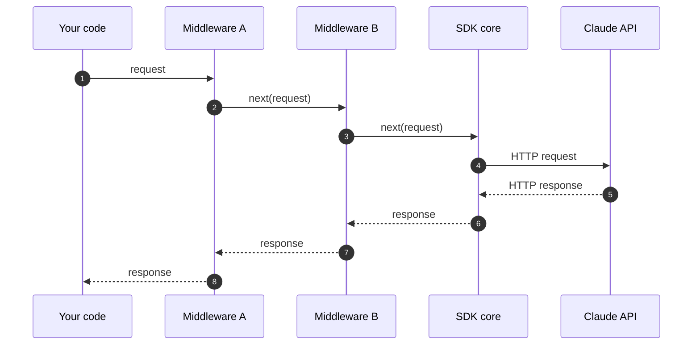

# Middleware SDK

Mencegat dan memodifikasi permintaan dan respons dalam SDK Anthropic.

---

SDK Anthropic menyediakan hook "middleware" (perangkat lunak perantara) atau interceptor yang memungkinkan Anda menjalankan kode sebelum permintaan dikirim dan setelah respons diterima. Gunakan middleware untuk kebutuhan lintas fungsi seperti logging, percobaan ulang kustom, anotasi permintaan, dan penanganan fallback penolakan.



Setiap middleware dapat memeriksa atau mengganti permintaan sebelum memanggil `next()`, dan respons setelah `next()` mengembalikan hasil.

## Mendaftarkan middleware

Setiap middleware adalah fungsi yang menerima permintaan keluar dan sebuah callable `next`. Panggil `next` untuk meneruskan permintaan ke bagian rantai berikutnya (atau langsung ke inti SDK jika ini adalah middleware terakhir), dan kembalikan responsnya. Apa pun yang ada sebelum pemanggilan `next` dijalankan saat permintaan keluar; apa pun yang ada setelahnya dijalankan saat respons kembali.

<Tabs>
  <Tab title="Python">
    ```python

    def logging_middleware(request: APIRequest, call_next: CallNext):
        # Sebelum permintaan
        print(f"-> {request.method} {request.url}")

        # Teruskan permintaan ke bagian rantai berikutnya
        response = call_next(request)

        # Setelah permintaan
        print(f"<- {response.status_code}")

        return response


    client = Anthropic(middleware=[logging_middleware])
    ```
  </Tab>

  <Tab title="TypeScript">
    ```typescript
    import Anthropic, { type Middleware } from "@anthropic-ai/sdk";

    const loggingMiddleware: Middleware = async (request, next, ctx) => {
      // Sebelum permintaan
      ctx.logger.debug("->", request.method, request.url);

      // Teruskan permintaan ke bagian rantai berikutnya
      const response = await next(request);

      // Setelah permintaan
      ctx.logger.debug("<-", response.status, request.url);

      return response;
    };

    const client = new Anthropic({ middleware: [loggingMiddleware] });
    ```
  </Tab>

  <Tab title="Go">
    ```go
    client := anthropic.NewClient(
    	option.WithMiddleware(func(req *http.Request, next option.MiddlewareNext) (res *http.Response, err error) {
    		// Sebelum permintaan
    		start := time.Now()
    		LogReq(req)

    		// Teruskan permintaan ke handler berikutnya
    		res, err = next(req)

    		// Tangani hal-hal setelah permintaan
    		LogRes(res, err, time.Since(start))

    		return res, err
    	}),
    )
    ```
  </Tab>

  <Tab title="Java">
    ```java
    AnthropicClient client = AnthropicOkHttpClient.builder()
        .fromEnv()
        .addInterceptor(Interceptor.syncOnly((nextClient, request, requestOptions) -> {
            // Sebelum permintaan
            IO.println(request.method() + " /" + String.join("/", request.pathSegments()));

            // Teruskan permintaan ke handler berikutnya
            HttpResponse response = nextClient.execute(request, requestOptions);

            // Setelah permintaan
            IO.println(response.statusCode());

            return response;
        }))
        .build();
    ```
  </Tab>

  <Tab title="C#">
    ```csharp
    using Anthropic.Core;

    AnthropicClient client = new()
    {
        Handlers =
        [
            Handler.Create(async (request, next, cancellationToken) =>
            {
                // Sebelum permintaan
                Console.WriteLine($"Sending {request.Method} {request.RequestUri}");

                // Teruskan permintaan ke handler berikutnya
                var response = await next(request, cancellationToken);

                // Tangani hal-hal setelah permintaan
                Console.WriteLine($"Received {(int)response.StatusCode}");

                return response;
            }),
        ],
    };
    ```
  </Tab>

  <Tab title="Ruby">
    <Note>
      Middleware saat ini belum tersedia di SDK Ruby.
    </Note>
  </Tab>

  <Tab title="PHP">
    <Note>
      Middleware saat ini belum tersedia di SDK PHP.
    </Note>
  </Tab>
</Tabs>

## Urutan middleware

Ketika Anda mendaftarkan beberapa middleware, middleware tersebut diterapkan sesuai urutan yang diberikan: kode "before" dari middleware pertama dijalankan terlebih dahulu, dan kode "after"-nya dijalankan terakhir. Middleware yang didaftarkan pada klien dijalankan sebelum middleware yang diteruskan sebagai opsi per permintaan.

Di SDK Go, pemanggilan `option.WithMiddleware` yang berulang akan digabungkan (klien terlebih dahulu, kemudian metode). Di SDK lainnya, teruskan sebuah array; entri yang lebih belakang membungkus yang lebih dalam.

## Mengganti klien HTTP

Setiap SDK juga menerima klien HTTP kustom (untuk konfigurasi proxy, TLS kustom, atau connection pooling). Hanya satu klien HTTP yang digunakan per klien SDK; mengaturnya akan menggantikan klien default. Klien HTTP kustom menerima permintaan setelah semua middleware selesai dijalankan.

## Middleware bawaan

SDK menyertakan middleware refusal-fallback yang secara otomatis mencoba ulang permintaan yang ditolak oleh Claude Fable 5 pada model fallback. Lihat [Mendeteksi dan mencoba ulang pada model fallback](/docs/id/build-with-claude/refusals-and-fallback#client-side-fallback) untuk pengaturan dan contoh per bahasa.
