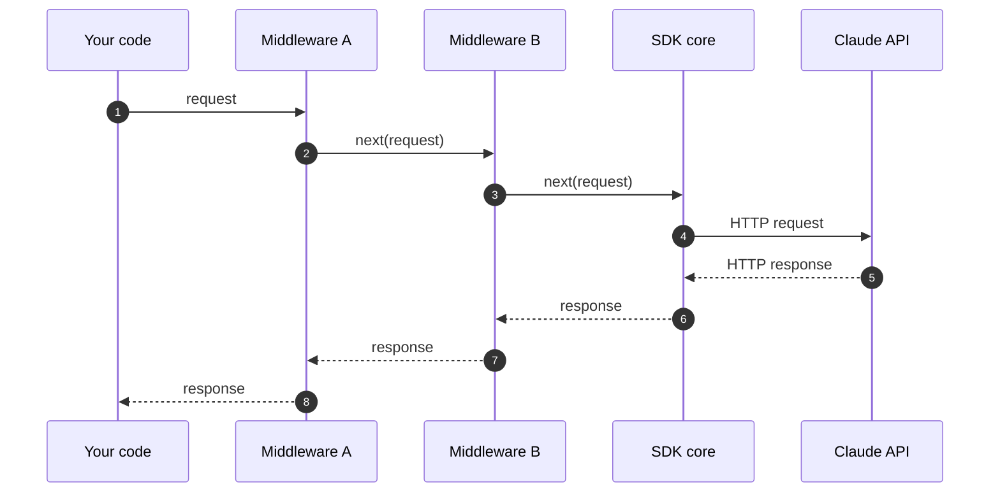

# Middleware SDK

Mencegat dan memodifikasi permintaan dan respons di SDK Anthropic.

---

SDK Anthropic menyediakan hook "middleware" (perangkat lunak perantara), atau interceptor, yang memungkinkan Anda menjalankan kode sebelum permintaan dikirim dan setelah respons diterima. Gunakan middleware untuk kebutuhan lintas-fungsi seperti logging, retry kustom, anotasi permintaan, dan penanganan fallback penolakan.



Setiap middleware dapat memeriksa atau mengganti permintaan sebelum memanggil `next()`, dan respons setelah `next()` mengembalikan hasil.

## Mendaftarkan middleware

Setiap middleware adalah fungsi yang menerima permintaan keluar dan sebuah callable `next`. Panggil `next` untuk meneruskan permintaan ke sisa rantai (atau langsung ke inti SDK jika ini adalah middleware terakhir), dan kembalikan responsnya. Apa pun sebelum pemanggilan `next` berjalan saat permintaan keluar; apa pun setelahnya berjalan saat respons kembali.

<CodeGroup exclude="shell">
  ```python Python
  def logging_middleware(request: APIRequest, call_next: CallNext) -> APIResponse[Any]:
      # Sebelum permintaan
      print(f"-> {request.method} {request.url}")

      # Teruskan permintaan ke sisa rantai
      response = call_next(request)

      # Setelah permintaan
      print(f"<- {response.status_code}")

      return response


  client = Anthropic(middleware=[logging_middleware])
  ```

  ```typescript TypeScript
  import type { Middleware } from "@anthropic-ai/sdk";

  const loggingMiddleware: Middleware = async (request, next, ctx) => {
    // Sebelum permintaan
    ctx.logger.debug("->", request.method, request.url);

    // Teruskan permintaan ke sisa rantai
    const response = await next(request);

    // Setelah permintaan
    ctx.logger.debug("<-", response.status, request.url);

    return response;
  };

  const client = new Anthropic({ middleware: [loggingMiddleware] });
  ```

  ```csharp C#
  AnthropicClient client = new()
  {
      Handlers =
      [
          Handler.Create(async (request, next, cancellationToken) =>
          {
              // Sebelum request
              Console.WriteLine($"Sending {request.Method} {request.RequestUri}");

              // Teruskan request ke handler berikutnya
              var response = await next(request, cancellationToken);

              // Setelah request
              Console.WriteLine($"Received {(int)response.StatusCode}");

              return response;
          }),
      ],
  };
  ```

  ```go Go
  client := anthropic.NewClient(
  	option.WithMiddleware(func(req *http.Request, next option.MiddlewareNext) (*http.Response, error) {
  		// Sebelum permintaan
  		start := time.Now()
  		slog.Info("sending request", "method", req.Method, "url", req.URL)

  		// Teruskan permintaan ke sisa rantai
  		res, err := next(req)
  		if err != nil {
  			return nil, err
  		}

  		// Setelah permintaan
  		slog.Info("received response", "status", res.StatusCode, "duration", time.Since(start))

  		return res, nil
  	}),
  )
  ```

  ```java Java
  AnthropicClient client = AnthropicOkHttpClient.builder()
      .fromEnv()
      .addInterceptor(Interceptor.syncOnly((nextClient, request, requestOptions) -> {
          // Sebelum permintaan
          IO.println(request.method() + " /" + String.join("/", request.pathSegments()));

          // Teruskan permintaan ke handler berikutnya
          HttpResponse response = nextClient.execute(request, requestOptions);

          // Setelah permintaan
          IO.println(response.statusCode());

          return response;
      }))
      .build();
  ```

  ```php PHP
  $loggingMiddleware = function (RequestInterface $request, callable $next): ResponseInterface {
      // Sebelum permintaan
      error_log("-> {$request->getMethod()} {$request->getUri()}");

      // Teruskan permintaan ke sisa rantai
      $response = $next($request);

      // Setelah permintaan
      error_log("<- {$response->getStatusCode()}");

      return $response;
  };

  $client = new Client(requestOptions: ['middleware' => [$loggingMiddleware]]);
  ```

  ```ruby Ruby
  logging_middleware = lambda do |request, call_next|
    # Sebelum permintaan
    puts "-> #{request.method.upcase} #{request.url}"

    # Teruskan permintaan ke sisa rantai
    response = call_next.call(request)

    # Setelah permintaan
    puts "<- #{response.status}"

    response
  end

  client = Anthropic::Client.new(middleware: [logging_middleware])
  ```
</CodeGroup>

## Urutan middleware

Ketika Anda mendaftarkan beberapa middleware, middleware tersebut diterapkan sesuai urutan yang diberikan: kode "sebelum" dari middleware pertama berjalan lebih dulu, dan kode "sesudah"-nya berjalan paling akhir. Middleware yang didaftarkan pada klien berjalan sebelum middleware yang diberikan sebagai opsi per-permintaan.

Di SDK Go, pemanggilan `option.WithMiddleware` yang berulang akan digabungkan (klien lebih dulu, kemudian metode). Di SDK lainnya, berikan sebuah array; entri yang lebih akhir membungkus yang lebih dalam.

## Mengganti klien HTTP

Setiap SDK juga menerima klien HTTP kustom (untuk konfigurasi proxy, TLS kustom, atau connection pooling). Hanya satu klien HTTP yang digunakan per klien SDK; mengaturnya akan menggantikan yang default. Klien HTTP kustom menerima permintaan setelah semua middleware berjalan.

## Middleware bawaan

SDK menyertakan middleware refusal-fallback yang secara otomatis mencoba ulang permintaan yang ditolak oleh Claude Fable 5 pada model fallback. Lihat [Deteksi dan coba ulang pada model fallback](/docs/id/build-with-claude/refusals-and-fallback#client-side-fallback) untuk penyiapan dan contoh per bahasa.
