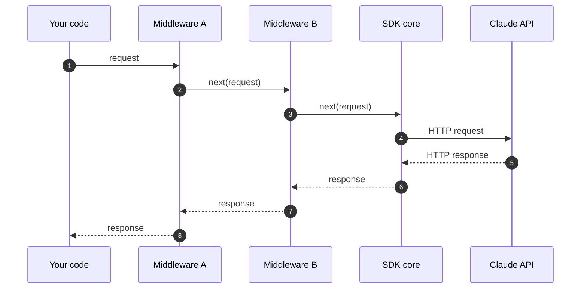

---
title: Middleware SDK
url: https://platform.claude.com/docs/id/cli-sdks-libraries/middleware
description: Mencegat dan memodifikasi permintaan dan respons SDK.
---

Claude SDK menyediakan hook "middleware" (perantara), atau interceptor, yang memungkinkan Anda menjalankan kode sebelum permintaan dikirim dan setelah respons diterima. Gunakan middleware untuk kebutuhan lintas bagian seperti logging, percobaan ulang kustom, anotasi permintaan, dan penanganan fallback penolakan.


```mermaid
sequenceDiagram
    accTitle: How a request and its response pass through middleware
    accDescr: Your code sends the request to Middleware A. Middleware A calls next(request) to pass it to Middleware B, and Middleware B calls next(request) to pass it to the SDK core. The SDK core sends the HTTP request to the Claude API and receives the HTTP response. The response returns through Middleware B, then Middleware A, to your code.
    autonumber
    participant App as Your code
    participant M1 as Middleware A
    participant M2 as Middleware B
    participant Core as SDK core
    participant API as Claude API
    App->>M1: request
    M1->>M2: next(request)
    M2->>Core: next(request)
    Core->>API: HTTP request
    API-->>Core: HTTP response
    Core-->>M2: response
    M2-->>M1: response
    M1-->>App: response
```

Setiap middleware dapat memeriksa atau mengganti permintaan sebelum memanggil `next()`, dan respons setelah `next()` kembali.

## Mendaftarkan middleware

Setiap middleware adalah fungsi yang menerima permintaan keluar dan handler berikutnya. Panggil `call_next(request)` (python; typescript: `next(request)`; csharp: `next(request, cancellationToken)`; go: `next(req)`; java: `nextClient.execute(request, requestOptions)`; php: `$next($request)`; ruby: `call_next.call(request)`) untuk meneruskan permintaan ke sisa rantai (atau langsung ke inti SDK jika ini adalah middleware terakhir), lalu kembalikan responsnya. Apa pun sebelum panggilan tersebut berjalan saat permintaan keluar; apa pun setelahnya berjalan saat respons kembali.

<CodeGroup exclude="shell">
  ```python Python
  def logging_middleware(request: APIRequest, call_next: CallNext) -> APIResponse[Any]:
      # Sebelum permintaan
      print(f"-> {request.method} {request.url}")

      # Teruskan permintaan ke sisa rantai
      response = call_next(request)

      # Setelah permintaan
      print(f"<- {response.status_code}")

      return response


  client = Anthropic(middleware=[logging_middleware])
  ```

  ```typescript TypeScript
  import type { Middleware } from "@anthropic-ai/sdk";

  const loggingMiddleware: Middleware = async (request, next, ctx) => {
    // Sebelum permintaan
    ctx.logger.debug("->", request.method, request.url);

    // Teruskan permintaan ke sisa rantai
    const response = await next(request);

    // Setelah permintaan
    ctx.logger.debug("<-", response.status, request.url);

    return response;
  };

  const client = new Anthropic({ middleware: [loggingMiddleware] });
  ```

  ```csharp C#
  AnthropicClient client = new()
  {
      Handlers =
      [
          Handler.Create(async (request, next, cancellationToken) =>
          {
              // Sebelum permintaan
              Console.WriteLine($"Sending {request.Method} {request.RequestUri}");

              // Teruskan permintaan ke handler berikutnya
              var response = await next(request, cancellationToken);

              // Setelah permintaan
              Console.WriteLine($"Received {(int)response.StatusCode}");

              return response;
          }),
      ],
  };
  ```

  ```go Go
  client := anthropic.NewClient(
  	option.WithMiddleware(func(req *http.Request, next option.MiddlewareNext) (*http.Response, error) {
  		// Sebelum permintaan
  		start := time.Now()
  		slog.Info("sending request", "method", req.Method, "url", req.URL)

  		// Teruskan permintaan ke sisa rantai
  		res, err := next(req)
  		if err != nil {
  			return nil, err
  		}

  		// Setelah permintaan
  		slog.Info("received response", "status", res.StatusCode, "duration", time.Since(start))

  		return res, nil
  	}),
  )
  ```

  ```java Java
  AnthropicClient client = AnthropicOkHttpClient.builder()
      .fromEnv()
      .addInterceptor(Interceptor.syncOnly((nextClient, request, requestOptions) -> {
          // Sebelum permintaan
          IO.println(request.method() + " /" + String.join("/", request.pathSegments()));

          // Teruskan permintaan ke handler berikutnya
          HttpResponse response = nextClient.execute(request, requestOptions);

          // Setelah permintaan
          IO.println(response.statusCode());

          return response;
      }))
      .build();
  ```

  ```php PHP
  $loggingMiddleware = function (RequestInterface $request, callable $next): ResponseInterface {
      // Sebelum permintaan
      error_log("-> {$request->getMethod()} {$request->getUri()}");

      // Teruskan permintaan ke sisa rantai
      $response = $next($request);

      // Setelah permintaan
      error_log("<- {$response->getStatusCode()}");

      return $response;
  };

  $client = new Client(requestOptions: ['middleware' => [$loggingMiddleware]]);
  ```

  ```ruby Ruby
  logging_middleware = lambda do |request, call_next|
    # Sebelum permintaan
    puts "-> #{request.method.upcase} #{request.url}"

    # Teruskan permintaan ke sisa rantai
    response = call_next.call(request)

    # Setelah permintaan
    puts "<- #{response.status}"

    response
  end

  client = Anthropic::Client.new(middleware: [logging_middleware])
  ```
</CodeGroup>

## Urutan middleware

Ketika Anda mendaftarkan beberapa middleware, middleware tersebut diterapkan sesuai urutan yang diberikan: kode "sebelum" dari middleware pertama dijalankan paling awal, dan kode "setelah"-nya dijalankan paling akhir. Middleware yang didaftarkan pada klien dijalankan sebelum middleware yang diteruskan sebagai opsi per permintaan.

Di SDK Go, pemanggilan `option.WithMiddleware` yang berulang akan digabungkan (klien terlebih dahulu, lalu metode). Di SDK lainnya, teruskan sebuah array; entri yang lebih akhir membungkus bagian dalam.

## Mengganti klien HTTP

SDK juga menerima klien HTTP kustom (untuk konfigurasi proxy, TLS kustom, atau "connection pooling" (pengumpulan koneksi)). Hanya satu klien HTTP yang digunakan per klien SDK; mengaturnya akan menggantikan klien default. Klien HTTP kustom menerima permintaan setelah semua middleware selesai berjalan.

## Middleware bawaan

SDK menyertakan middleware refusal-fallback yang secara otomatis mencoba ulang permintaan yang ditolak Claude Fable 5 pada model fallback. Lihat [Mendeteksi dan mencoba ulang pada model fallback](https://platform.claude.com/docs/id/build-with-claude/refusals-and-fallback#client-side-fallback) untuk penyiapan dan contoh per bahasa.
